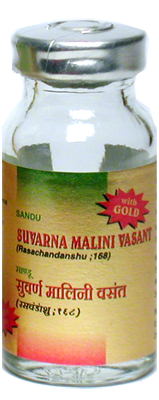

# Suvarnamalini vasanta rasa

[TOC]

1. It has rejuvenative and antioxidant action on body.
1. It improves immune system and increases body’s strength to resist against diseases.
1. It is effective in chronic fever associated with splenomegaly and diminished digestive capacity.
1. It is useful in tuberculosis, Malaria and Pyrexia of Unknown origin.
1. It is useful in all age groups including children, elderly, young, adults and pregnant women.
1. It is useful for all diseases and can be useful in person of any type of body constitution (Prakruti).

## Indications
1. Chronic fever
1. Tuberculosis
1. Cough
1. Bronchial Asthma
1. Heart disease
1. Menorrhagia
1. Leucorrhoea.

## Dose
1 tablet 2 times

## Ingredients
Suvarna bhasma
Mouktika bhasma
Purified Hingul (Cinnabar)
Piper nigrum
Shuddha Kharpar
Butter
Citrus limon.
