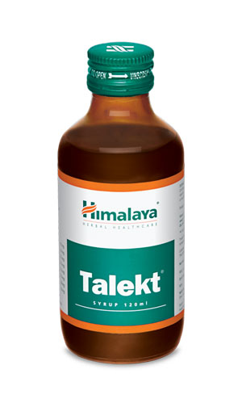

# Talekt syrup

[TOC]

## Action
Skin disorders: Talekt’s antimicrobial and detoxifying properties combat dermal infections caused by gram-positive and gram-negative bacteria. The anti-allergic property of Talekt controls itching associated with dermal infections and allergies.

## Indications
* Sebaceous gland disorders:
* Infective and noninfective acne vulgaris
* Rosacea (facial redness, inflammation of the cheek, nose, chin and forehead)
* Bacterial skin infections:
* Furuncles and carbuncles (infections of the hair follicle)
* Paronychia (bacterial hand/foot nail infection)
* Dermatitis:
* Infective
* Allergic
* Systemic mycoses:
* Ringworm
* Candidiasis (fungal yeast infection)
* Parasitic skin infections:
* Scabies
* Pediculosis (lice infestation)
* Papulosquamous disorders:
* Psoriasis

## Key ingredients
* Ayurveda texts and modern research back the following facts:

* Turmeric ([Haridra](Haridra.md)) has strong anti-inflammatory and anti-allergic properties, which soothe the skin. It significantly inhibits OVA-induced allergies that extend anti-allergic reactions. Turmeric is also a potent antimicrobial agent that combats common bacteria. The herb also speeds up the wound healing process.

* Neem ([Nimba](Nimba.md)) is especially beneficial for bacterial skin disorders. Acne-causing bacteria are instantly killed by Neem leaves. It is a detoxifier that eliminates impurities from the skin’s surface and an anti-inflammatory, which is useful in combating various dermatological disorders.

## Directions for use
* Please consult your physician to prescribe the dosage that best suits your condition.

## Side effects
* Talekt is not known to have any side effects if taken as per the prescribed dosage.

## References

## References

1. Products of the Himalaya Drug Company
