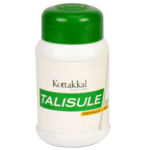

# Talisule Granule

[TOC]

**Talisule Granule** is effective in conditions like Upper Respiratory tract Infections, Sinusitis, Cough, Asthma, Bronchitis and Anorexia. It soothes the inflammation of the mucosal membranes and acts as an expectorant. It helps to enhance the immune responses and inhibits allergic inflammations.

## Indications for use of Talisule Granule
Upper respiratory tract infection, Sinusitis, Anorexia.

## Each 10g Talisule Granule is prepared out of
* Talisapatra (Abies spectabilis) - 0.178g
* Chavika (Piper brachystachyum) - 0.178g
* Maricha (Piper nigrum) - 0.178g
* Krishna (Piper longum) - 0.356g
* Krishnamula (Piper longum Wild) - 0.356g
* Sunthi (Zingiber officinale) - 0.540g
* Ela (Elettaria cardamomum) - 0.045g
* Tvak (Cinnamomum verum) - 0.045g
* Patra (Cinnamomum tamala) - 0.045g
* Nagakesara (Mesua ferrea) -0.045g
* Useera (Vetiveria zizaniodes) - 0.045g
* Sita (Saccharum officinarum) - 7.860g
