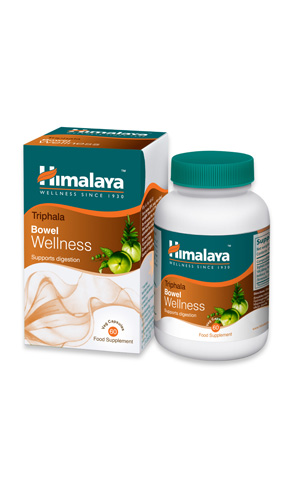

# Triphala Wellness

[TOC]

Triphala combines the goodness of Indian Gooseberey, Belleric Myrobalan and Chebulic Myrobalan, helps to benefit digestion, maintain bowel function. Triphala may help in digestion and promotes general gastrointestinal health.

## Use directions:
One capsule twice daily after food.

## Who can benefit from Triphala
1. People with chronic constipation
1. People with indigestion, abdominal bloating and belching.
