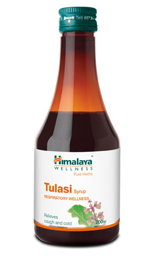

# Tulasi Syrup

[TOC]

## Herb functions:
Helps suppress cough and aids the mobilization of mucus.

Assists in calming and dilating the lung's airways, thus relieving chest congestion.

The oleonolic acid, urosolic acid and polyphenolic constituents in Tulasi help in alleviating allergic or infection induced airway inflammation.

    Modulates healthy immune response and supports early recovery from respiratory illness.

Best Used When Having:

Seasonal cold

Recurrent respiratory infections

Chronic obstructive lung diseases, asthma and bronchitis (as a supportive therapy)

## Good to Know:
* 100% vegetarian.

* Free from sugar, artificial colors, artificial flavors, preservatives, and gelatin.

## Composition:
Each 5 ml contains 112 mg of Tulasi (Ocimum sanctum) Aerial part extract
Dosage Recommendation:

Children: 5 ml (1 teaspoonful) twice a day

Adults: 10 ml (2 teaspoonful) twice a day
Special Instructions:

    Please inform your physician before consuming in the following situations:
        Pregnancy
        Breastfeeding
        Diabetes
        Hypertension
    Specific contraindications have not been identified.

    Please consult your physician if symptoms persist.
