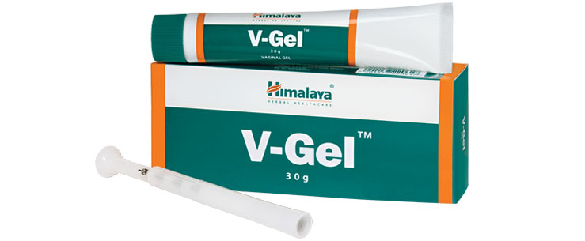

# V-Gel

[TOC]

## Action
Treats vaginitis and cervicitis: The antimicrobial, antibacterial and antifungal properties of V-Gel effectively combat the organisms responsible for vaginitis (inflammation and infection of the vagina or vulva) and cervicitis (inflammation of the cervix). The gel’s demulcent action soothes the inflamed vagina and cervix, relieves itching and accelerates the healing process.

## Indications
* Vaginitis
* Vaginal candidiasis (fungal yeast infection)
* Vaginal trichomoniasis (parasitic vaginal infection)
* Nonspecific bacterial vaginitis
* Prevention of post-operative vaginal infections
* Cervicitis
* Leukorrhea (thick and white/yellow vaginal discharge)

## Key ingredients
* Ayurveda texts and modern research back the following facts:

* Triphala is anti-inflammatory and antibacterial agent that soothes irritation and eliminates bacteria in the female reproductive system.

* Persian Rose ([Satapatri](Satapatri.md)) acts as an antiviral, which reduces the maturation of the infectious progeny virus by selective inhibition of viral protease. It also has antibacterial properties that combat gram-positive and gram-negative bacteria responsible for female reproductive tract infections.

* Cardamom ([Ela](Ela.md)) has analgesic properties that alleviate pain associated with vaginitis, cervicitis and leukorrhea.

## Directions for use
* Please consult your physician to prescribe the dosage that best suits your condition.

## Side effects
* V-Gel is not known to have any side effects if applied or used as per the prescribed dosage.

## References

## References

1. Products of the Himalaya Drug Company
