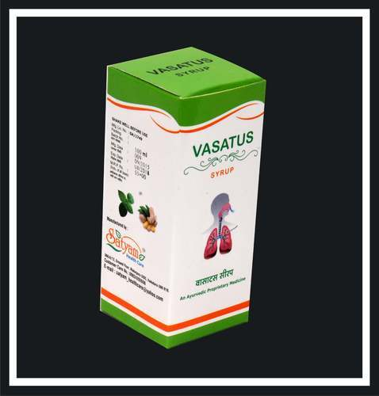

# Vasatus Cough Syrup

[TOC]

**Vasatus Cough Syrup** is an herbal cough syrup which helps in preventing cold, cough, etc

## key ingredients
* Vasaka
* Tulsi
* Ginger
* Yasthimadhu
* Kantakari
* Phudina
* Lindipipper

## External Links
[Satyam Health Care](http://www.indiamart.com/satyamhealthcare/herbal-cough-syrup.html)
