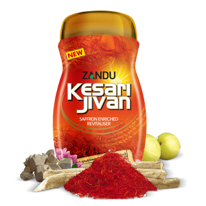

# Zandu Kesari Jivan

[TOC]

ZKJ is a health supplement filled with the goodness of Kesar, fresh Amla, exotic herbs, spices & trace minerals. It not only makes one physically strong but also keeps the youthful vigour intact.

## Composition
Each 100g is prepared from: Amalaki (fresh) pulp 45g, Kunkuma (Saffron) 200mg, Asvagandha 200mg, Suksmaila (Elaichi) 100mg, Lavanga 200mg, Marica 200mg, Sunthi 200mg, Jatiphala 100mg, Tvak 100mg, Tejapatra 100mg, Pippali 200mg, Goksura 200mg, Nagakesara 100mg, Musali 100mg, Vidanga 100mg, Atmagupta (Kauncha beej) 100mg, Bala (beej) 200mg, Vamsa (Vanshlochan) 400mg, Godanti bhasma (A.F.I.-1) 100mg, Mukta Sukti pisti (S.Y.S.) 100mg, Abhraka bhasma (A.F.I.-1) 50mg, Yasada bhasma (A.F.I.-1) 50mg, Ghrta (Ghee) 5g, Iksu (Sarkara) & Approved preservatives i.e. (Sodium Benzoate and Potassium Metabisulphite) q.s

## Dosage
1 to 2 teaspoons every morning preferably with milk or Zandu Honey.

* Saffron Enriched Revitaliser - Zyada Kesar, Zyada Sehat.
