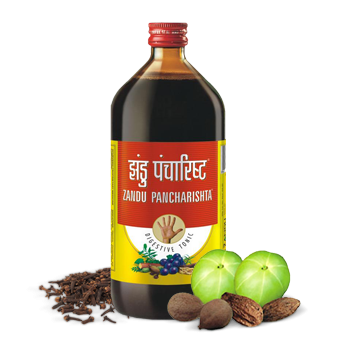

# Zandu Pancharishta

[TOC]

Zandu Pancharishta is a unique Ayurvedic Digestive Tonic enriched with the goodness of Ayurvedic herbs and ingredients. It acts on the entire digestive system, building digestive immunity and reducing the recurrence of digestive problems like acidity, gas, indigestion, flatulence and constipation.

## Composition
Each 100 ml is prepared from: Draksa , Kumari: 2.5 g each, Dashmoola: 2.0 g, Asvagandha Satavari : 1.0 g each, Triphala: 0.6 g, Guduci, Bata, Yasti :0.5,Trikatu, Trijat :0.3 g each, Arjuna, Lodhra, Manjistha 0.2 g each, Ajamoda, Dhanyaka, Haridra, Sati, Sveta, Jiraka, Lavanga 0.1g each.

## Dosage
Mix 2 Tablespoons (30ml) with equal quantity of water, take twice regularly after meals, or as advised by physicians.

* Zandu Pancharishta is a complete digestive tonic that works on root cause by revitalizing the overall digestive system and improves your appetite.
