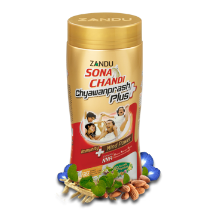

# Zandu Sona Chandi Chyawanprash

[TOC]

1. "Immunity PLUS Mind Power" - Ordinary Chyawanprash provides you with immunity, but just immunity is not enough in today's competitive world. To stay ahead in life you need the power of "PLUS".
1. Only Zandu Sona Chandi Chyawanprash "Plus" offers you Immunity + 3 Mind Benefits of Alertness, Better Memory & Concentration owing to the presence of NNA.
1. Natural Nootropic Agents (NNA) are traditionally known ayurvedic ingredients like Brahmi, Almond oil, Shankhapushpi, Ashwagandha, & Jyotishmati which has been scientifically proven to improve memory, learning and concentration.

## Composition
Each 100g contains: concentrated Aqueous Extracts of Agnimantha, Bala, Bilva, Gambhari, Haritaki, Jeevanti, Mashaparni, Mudgaparni, Musta, Shalaparni, Patala, Prishniparni, Punarnava, Shati, Shyonaka, Vidarikanda 0.16g each, Brihati, Gokshura, Kantakari 0.04g each, Bhumiamalaki, Jeevaka, Kakoli, Kakanasa, Keshar, Meda, Riddhi, Rishabhaka, Shringi, Utpala, Vanshalochana 0.01g each, Guduchi, Vasamula 0.08g each, Arjuna, Brahmi, Shankhapushpi 0.40g each, Jyotishmati 0.35g, Amalaki Pisti 24.00g, Madhu 1.50g, Sharkara 66.00g, Apple Juice 0.05g, Bhasma of Abhraka, Mukta Shukti, Svarna Makshika 0.10g each, Vark of Chandi (Silver) 32.80mg, Vark of Sona (Gold) 0.0584mg, Dalchini, Elaichi, Nagkeshar, Tejpatra 0.50g each, Pippali 0.55g, Water & Approved Preservatives (Methyl Paraben, Propyl Paraben, Sodium Benzoate) q.s.

## Dosage
1/2 to 1 teaspoonful with milk or honey twice daily.

* Unique & improved formulation of "Zandu Sona Chandi Chyawanprash Plus" is packed with the power of Natural Nootropic Agents (NNA). NNA are traditionally known ayurvedic ingredients like Brahmi, Almond oil, Shankhapushpi, Ashwagandha, & Jyotishmati which has been scientifically proven to improve memory, learning and concentration.
* Brahmi: Cognitive enhancing agent
* Shankhapushpi: Improves learning behavior
* Almond Oil: Effective memory exhilarant
* Ashwagandha: Potent anti-stress and adaptogen
* Jyotishmati: Boosts retention and cognition
