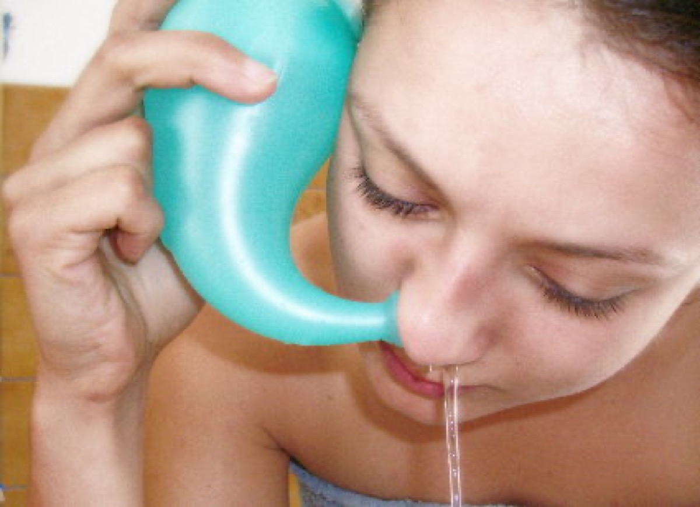

# Neti Pot

**Nasal irrigation ** or nasal lavage or nasal douche, is a personal hygiene practice in which the nasal cavity is washed to flush out excess mucus and debris from the nose and sinuses. The practice is generally well-tolerated and reported to be beneficial with only minor side effects. Nasal irrigation in a wider sense can also refer to the use of saline nasal spray or nebulizers to moisten the mucous membranes.

According to its advocates, nasal irrigation promotes good sinus and nasal health. Patients with chronic sinusitis including symptoms of facial pain, headache, halitosis, cough, anterior rhinorrhea (watery discharge) and nasal congestion are reported often to find nasal irrigation to provide relief. In published studies, "daily hypertonic saline nasal irrigation improves sinus-related quality of life, decreases symptoms, and decreases medication use in patients with frequent sinusitis", and irrigation is recommended as an adjunctive treatment for chronic sinonasal symptoms.
