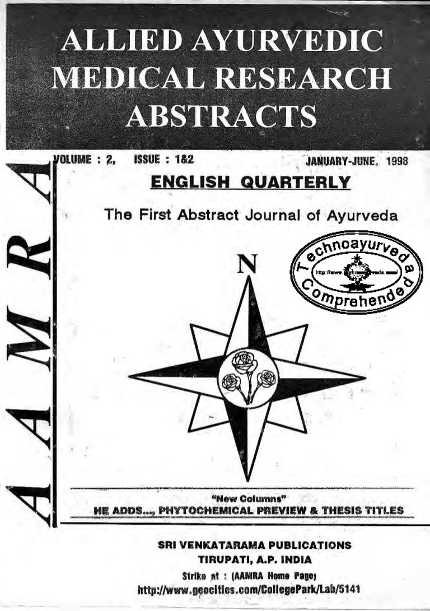

# Allied Ayurvedic Medical Research Abstracts (AAMRA)

* Allied ayurvedic medical research abstracts : AAMRA.**

| | |
| --- | --- |
| Type | Journal, magazine : Periodical : English |
| Products | Medicine, Ayurvedic -- Abstracts -- Periodicals.Medicine, Ayurvedic. |
| Homepage | http://www.worldcat.org/title/allied-ayurvedic-medical-research-abstracts-aamra/oclc/45209762 |
| Location | Tirupati : Prospective Ayurvedic Researchers' Academy |

AARMA provides information about ayurvedic medicines through journals and magazines.
