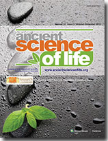

# Ancient Science of Life

* Ancient Science of Life**

| | |
| --- | --- |
| Type | Journal |
| Products | Ayurveda,allied disciplines and all forms of traditional medicine. |
| Homepage | http://www.ancientscienceoflife.org/ |
| Location | AVP Research Foundation, PB No. 7102, Trichy Road,Ramanathapuram P.O.,Coimbatore 641045 |

Ancient Science of Life, is the oldest peer reviewed scientific journal in Ayurveda which publishes full-length original papers and reviews on Ayurveda, allied disciplines and all forms of traditional medicines. The journal provides an inter-disciplinary platform for linking traditional knowledge with the latest advancements in science. Preferences are given for contributions that interface Ayurveda with disciplines like botany, ethnobotany, ethnomedicine, ethnopharmacology, biology, biotechnology, medicinal chemistry, pharmacology, clinical pharmacology, phytochemistry, pharmacognosy, clinical research, animal experiments and the like.
Articles on traditional medicines from the perspective of history of medicine, medical anthropology, medical sociology, epidemiology and community medicine will also be accepted. Original literary studies covering aspects of linguistics, philology, literary criticism and critical editing of the original writings of Ayurveda and other traditional systems of medicine will also be accepted for publication. All submissions are subjected to stringent peer review process before publication.
