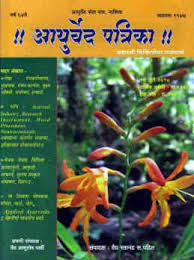

# Ayurved Patrika

* Ayurved Patrika**

| | |
| --- | --- |
| Type | Publisher |
| Key people | Late Vd. Bindu Madhav Pandit |
| Products | National Journal & the only Scientific Magazine. |
| Homepage | http://ayurvedpatrika.com/ |
| Founded | 1947 |
| Location | Ayurved Patrika Ayurved Seva Sangh,Ganeshwadi, Near Gadge Maharaj Bridge, Panchavati,Nashik – 422003(Maharashtra, India) |

Ayurved Patrika is a National Journal & the only Scientific Magazine which is being published uninterruptedly since last 67 years. On 18th July 1947, 1st issue was published by Ayurved Seva Sangha, Nashik. The very first editor & founder member was Late Vd. Bindu Madhav Pandit in the aim of incorporating disperse Ayurvedic doctors & their knowledge to propagate Ayurveda. From 1947 this magazine is constantly publishing without any interruption. Upto 1964, it was published fortnightly & then as monthly edition till date.

The Ayurved Seva Sangh, Nashik is an eminent social and educational institution in the city which has been working in the field of health services through Ayurveda.

The institution was established at Ahmednagar in 1924 and was shifted  to Nashik in 1945 and since then it has been doing substantial work in the field of health services. Patriotic workers had soul the seedling of this institution in pre independence era. The seedling has today grown in big blossoming tree.
