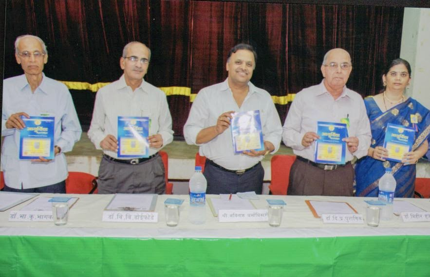

# Ayurvidya

* Ayurvidya**

| | |
| --- | --- |
| Type | Ayurvidya Magazine |
| Products | Shalakya Vikar” and “Pitta Vikar ” |
| Homepage | http://ayurvidyamagazine.blogspot.in |
| Founded | 1937 |
| Location | Tilak Ayurved Mahavidyalaya, Pune |

This monthly magazine is regularly published since 1937, It facilitates communication amongst vaidyas, students and teachers, informs Ayurvedic news, Research and publish achievements , activity of various individuals, organizations working in the field of Ayurveda. Some special issues for special events and occasions. Recently , “Shalakya Vikar” and “Pitta Vikar ” Special issue was published. Now “Ayurvidya Peer Review Journal” is Published 2 times in a year. This year Ayurvidya has started Publishing “Ayurvidya Internationa Journal”. It will be Published Twice a year.
