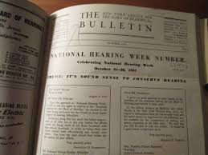

# Bulletin of the Indian Institute of History of Medicine

* Bulletin of the Indian Institute of History of Medicine**

| | |
| --- | --- |
| Type | Journals |
| Key people | B. Rao |
| Products | Medicine:Medicine (miscellaneous) |
| Homepage | http://www.scimagojr.com |
| Founded | 1971 |
| Location | Hyderabad, India |

Department felt necessary to start a Bulletin to publish the source material collected and the results of research work done from time to time. A Bulletin of Department of History of Medicine was started from January, 1963 as a quarterly. This publication continued for three years and then stopped for various reasons. After the Institute was taken over by the Central Council for Research in Indian Medicine and Homoeopathy, the Bulletin was revived in the year 1971, as Bulletin of Institute of History of Medicine and the Volume number was started a fresh. In the year 1974 the name of the Institute was changed as Indian Institute of History of Medicine and as such the name of the Bulletin was also changed as the Bulletin of the Indian Institute of History of Medicine.
