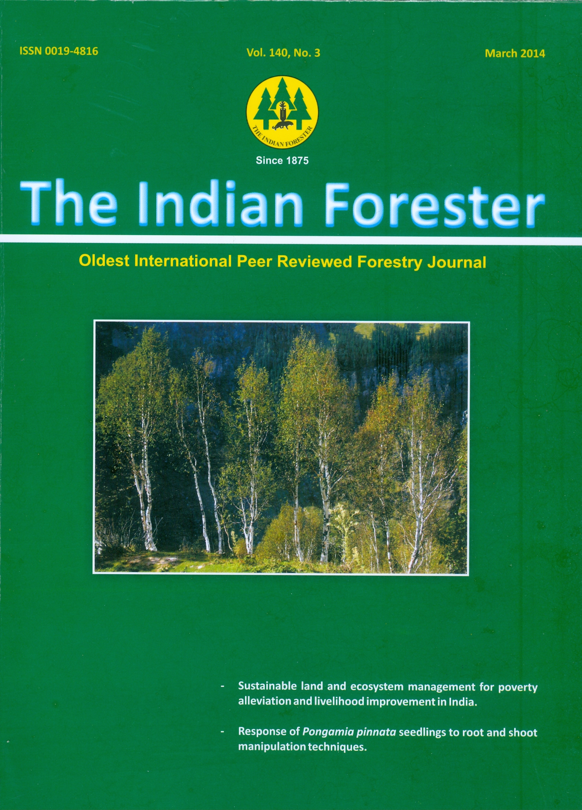

# Indian Forester

* Indian Forester**

| | |
| --- | --- |
| Type | Journal |
| Products | Journal |
| Homepage | http://www.indianforester.co.in/index.php/indianforester/index |
| Founded | 1875 |
| Field 65 | The Indian Forester P.O. New Forest, Dehradun - 248006 (Uttarakhand) |

The Indian Forester has always endeavoured to provide its readers, the information regarding the latest Research & Developments in the country on topical issues by bringing out Special issues on topics such as Conservation, Eucalyptus, Earth Summit, Vegetative Propagation, Biodiversity, Sustainable Development, Teak (Tectona Grandis), Wild Life Conservation, Neem, Agro forestry, Participatory Forestry Management, Environment, Poplar, Wood, Energy, Social Forestry, Bamboo, Medicinal Plants and Climate Change.
