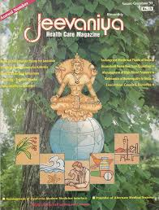

# Jeevaniya (Hindi & Eng.)

* Test Infobox**

| | |
| --- | --- |
| Type | Publisher |
| Products | Health Magazines |
| Homepage | http://jeevaniya.net/index.php |
| Founded | 1989 |
| Location | Secretary Jeevaniya Soceity474 A / 60 (30 New) Brahm Nagar, Sitapur Road, Lucknow,  Uttar Pradesh |
| Field 6 | (+91) (0522) (3298167) |
| E - mail | Jeevaniya.society@gmail.com |

The Society has pioneered in publication of a variety of IEC material, particularly in Hindi, to fulfill the needs of authentic information in easily comprehensible language and style. "Jeevaniya", a popular bimonthly Health Care magazine was published for ten years (1989-98), both in Hindi & English as part of our Awareness Campaign to promote revitalization of Local Health Traditions & Traditional Health Systems.

* Now the production is stopped.
