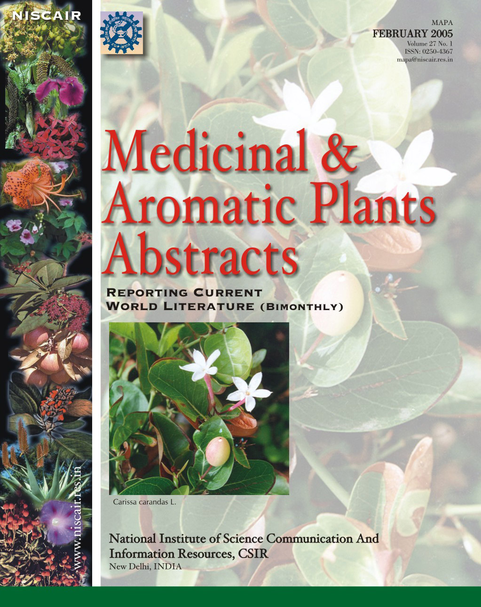

# Medicinal & Aromatic Plants Abstracts

* Medicinal & Aromatic Plants Abstracts**

| | |
| --- | --- |
| Type | Publisher |
| Key people | Hemlata Makhija ; Dr. Monika Jaggi |
| Products | Journal |
| Homepage | http://mapa.niscair.res.in/Hm.aspx |
| Founded | 1979 |

Medicinal and Aromatic Plants Abstracts (MAPA) is a bimonthly abstracting journal covering global current literature on all aspects of medicinal, aromatic and allied plants, including lower plants. It was started in 1979 as a printed publication. It involves scanning, selection and abstracting relevant research papers from primary journals and patents published from different countries in English language. Each record contains information about author(s), author affiliation, title of the paper, bibliographic details and an informative abstract. It also covers information on forthcoming conferences /seminars /meetings and latest published books on Medicinal Plants.
