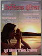

# Mystic India

* Mystic India**

| | |
| --- | --- |
| Type | Publisher |
| Key people | M.C. Bhandari |
| Products | Magazines |
| Homepage | https://www.blogger.com |
| Founded | 1995 |
| Location | Delhi, Delhi, India |

Mystic India is a magazine based on holistic health and fitness. It deals with self discovery and contentment. It has various enriching articles written by upcoming and established experts. It's a by-monthly magazine published in English and Hindi alternatively. It is being published since the last 14years and is popular among lacs of readers worldwide. Lt. sh. M.C. Bhandari, a leading Chartered Accountant of his time and the President of ICAI, founded this magazine in 1995. He started the trend of Exibitions based on ancient Indian sciences.
