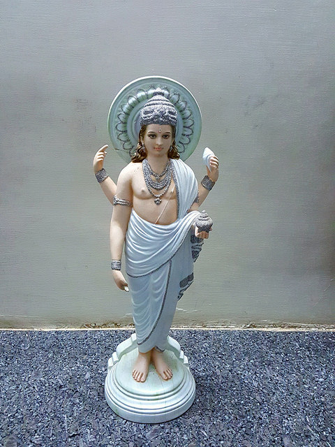
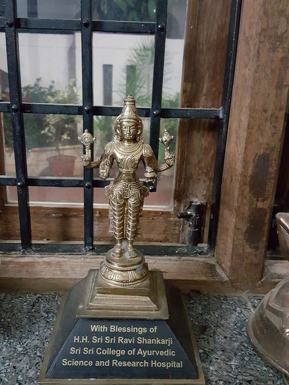
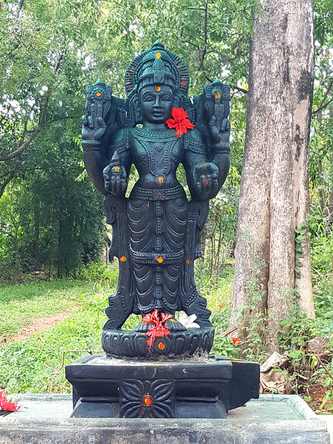
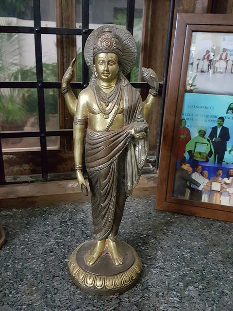
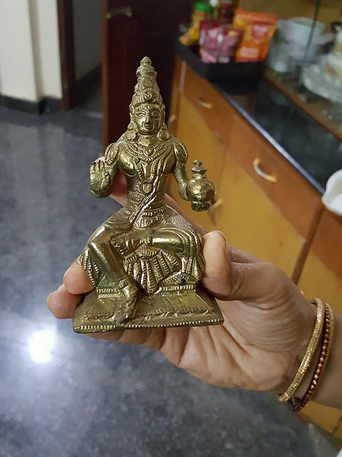
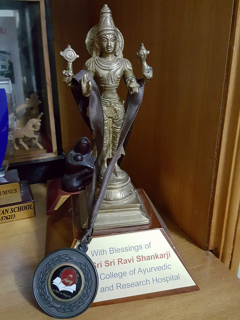
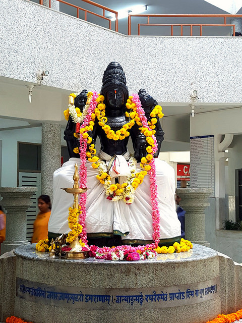
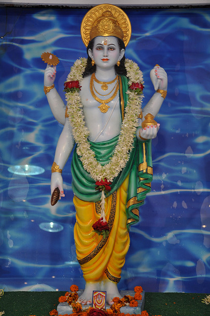

# Dhanvantari

[TOC]

**Dhanvantari**  is an avatar of Vishnu in Hinduism. He appears in the Vedas and Puranas as the physician of the gods (devas), and the god of Ayurveda. It is common practice in Hinduism for worshipers to pray to Dhanvantari seeking his blessings for sound health for themselves and/or others, especially on Dhanteras.

## References

## External links
* ["Flicker"](https://www.flickr.com/photos/hpnadig/)

## References

1. ["Wikipedia"](https://en.wikipedia.org/wiki/Dhanvantari)
