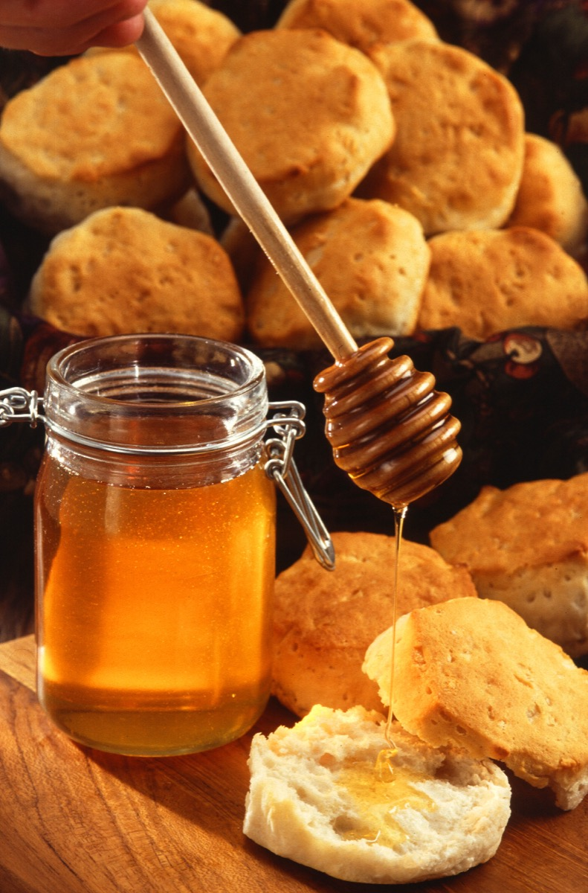

# Madhu - Honey

[TOC]

**Honey** is a sweet food made by bees foraging nectar from flowers. The variety produced by honey bees (the genus Apis) is the one most commonly referred to, as it is the type of honey collected by most beekeepers and consumed by people. Honey is also produced by bumblebees, stingless bees, and other hymenopteran insects such as honey wasps, though the quantity is generally lower and they have slightly different properties compared with honey from the genus Apis. Honey bees convert nectar into honey by a process of regurgitation and evaporation: they store it as a primary food source in wax honeycombs inside the beehive.

## Medical uses
* Wounds and burns

Honey contains trace amount of compounds implicated in preliminary studies to have wound healing properties, such as hydrogen peroxide and methylglyoxal.

There is some evidence that honey may help healing in skin wounds after surgery and mild (partial thickness) burns when used in a dressing, but in general the evidence for the use of honey in wound treatment is of such low quality that firm conclusions cannot be drawn.

Evidence does not support the use of honey-based products in the treatment of venous stasis ulcers or ingrowing toenail.

There is ongoing research into medical uses for honey, particularly in the face of antimicrobial resistance to modern antibiotics.
* Cough

For chronic cough and acute cough, a Cochrane review found no strong evidence for or against the use of honey. For treating children, the study concluded that honey possibly helps more than no treatment.

The UK Medicines and Healthcare Products Regulatory Agency recommends avoiding giving over the counter cough and common cold medication to children under 6, and suggests "a homemade remedy containing honey and lemon is likely to be just as useful and safer to take", but warns that honey should not be given to babies because of the risk of infant botulism. The World Health Organization recommends honey as a treatment for coughs and sore throats, including for children, stating that there is no reason to believe it is less effective than a commercial remedy. Honey is recommended by one Canadian physician for children over the age of 1 for the treatment of coughs as it is deemed as effective as dextromethorphan and more effective than diphenhydramine.
* Other

People who have a weakened immune system should not eat honey because of the risk of bacterial or fungal infection.

No evidence shows the benefit of using honey to treat cancer,although honey may be useful for controlling side effects of radiation therapy or chemotherapy applied in cancer treatment.

Consumption is sometimes advocated as a treatment for seasonal allergies due to pollen, but there is inconclusive scientific evidence to support the claim. Honey is generally considered ineffective for the treatment of allergic conjunctivitis.

Preliminary studies found honey to contain an antimicrobial peptide called bee defensin-1.Some in vitro studies show that honey can kill Methicillin-resistant Staphylococcus aureus (MRSA), β-haemolytic streptococci and vancomycin-resistant Enterococc

## Adverse effects
Although honey is generally safe when taken in typical food amounts,there are various, potential adverse effects or interactions it may have in combination with excessive consumption, existing disease conditions or drugs. Included among these are mild reactions to high intake, such as anxiety, insomnia or hyperactivity in about 10% of children, according to one study. No symptoms of anxiety, insomnia or hyperactivity were detected with honey consumption compared to placebo, according to another study. Honey consumption may interact adversely with existing allergies, high blood sugar levels (as in diabetes), or anticoagulants used to control bleeding, among other clinical conditions.
* Botulism

Infants can develop botulism after consuming honey contaminated with Clostridium botulinum endospores.

Infantile botulism shows geographical variation. In the UK, only six cases have been reported between 1976 and 2006,[91] yet the U.S. has much higher rates: 1.9 per 100,000 live births, 47.2% of which are in California. While the risk honey poses to infant health is small, it is recommended not to take the risk until after one year of age, and then giving honey is considered safe.
* Toxic honey
Main article: Bees and toxic chemicals § Toxic honey

Mad honey intoxication is a result of eating honey containing grayanotoxins. Honey produced from flowers of rhododendrons, mountain laurels, sheep laurel, and azaleas may cause honey intoxication. Symptoms include dizziness, weakness, excessive perspiration, nausea, and vomiting. Less commonly, low blood pressure, shock, heart rhythm irregularities, and convulsions may occur, with rare cases resulting in death. Honey intoxication is more likely when using "natural" unprocessed honey and honey from farmers who may have a small number of hives. Commercial processing, with pooling of honey from numerous sources, is thought to dilute any toxins.

Toxic honey may also result when bees are proximate to tutu bushes (Coriaria arborea) and the vine hopper insect (Scolypopa australis). Both are found throughout New Zealand. Bees gather honeydew produced by the vine hopper insects feeding on the tutu plant. This introduces the poison tutin into honey.[96] Only a few areas in New Zealand (the Coromandel Peninsula, Eastern Bay of Plenty and the Marlborough Sounds) frequently produce toxic honey. Symptoms of tutin poisoning include vomiting, delirium, giddiness, increased excitability, stupor, coma, and violent convulsions.[medical citation needed] To reduce the risk of tutin poisoning, humans should not eat honey taken from feral hives in the risk areas of New Zealand. Since December 2001, New Zealand beekeepers have been required to reduce the risk of producing toxic honey by closely monitoring tutu, vine hopper, and foraging conditions within 3 kilometres (1.9 mi) of their apiary.[citation needed] Intoxication is rarely dangerous.

## References

## References

1. ["wikipedia"](https://en.wikipedia.org/wiki/Dhanvantari)
