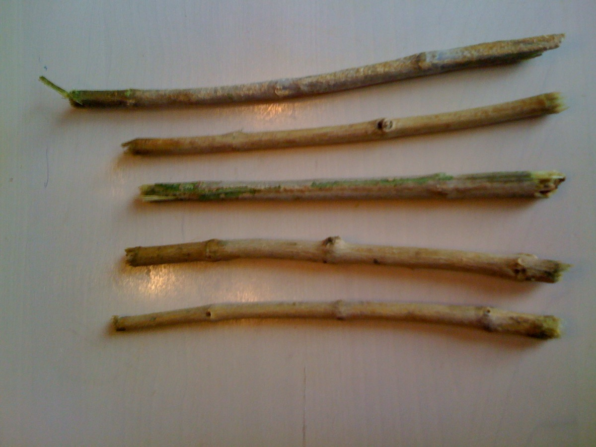

# Miswak

The miswak (miswaak, siwak, sewak) is a teeth cleaning twig made from the Salvadora persica tree (known as arak in Arabic). A traditional and natural alternative to the modern toothbrush, it has a long, well-documented history and is reputed for its medicinal benefits. It is reputed to have been used over 7000 years ago. The miswak's properties have been described thus: "Apart from their antibacterial activity which may help control the formation and activity of dental plaque, they can be used effectively as a natural toothbrush for teeth cleaning. Such sticks are effective, inexpensive, common, available, and contain many medical properties". It also features prominently in Islamic hygienical jurisprudence.

The miswak is predominant in Muslim-inhabited areas. It is commonly used in the Arabian peninsula, the Horn of Africa, North Africa, parts of the Sahel, the Indian subcontinent, Central Asia and Southeast Asia. In Malaysia, miswak is known as Kayu Sugi (Malay for 'chewing stick').
