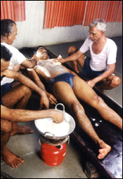

# Navarakizhi

Medicated oil is first applied liberally over the patient’s body. Then the body is massaged with small linen bags filled with cooked Navara rice. The rice is cooked by boiling it in cow’s milk along with suitable. The linen bags filled with rice are dipped in the same mixture kept boiling over a gentle flame and applied by masseurs at a comfortable temperature over the whole body of the patient.

Navarakkizhi is a special massage , which rejuvenates the body. It is very effective in degenerative muscle diseases like poliomyelitis muscular atrophy etc. It is more effective when done immediately after Pizhichil treatment . The course of treatment can last for 14 or 21 days.
