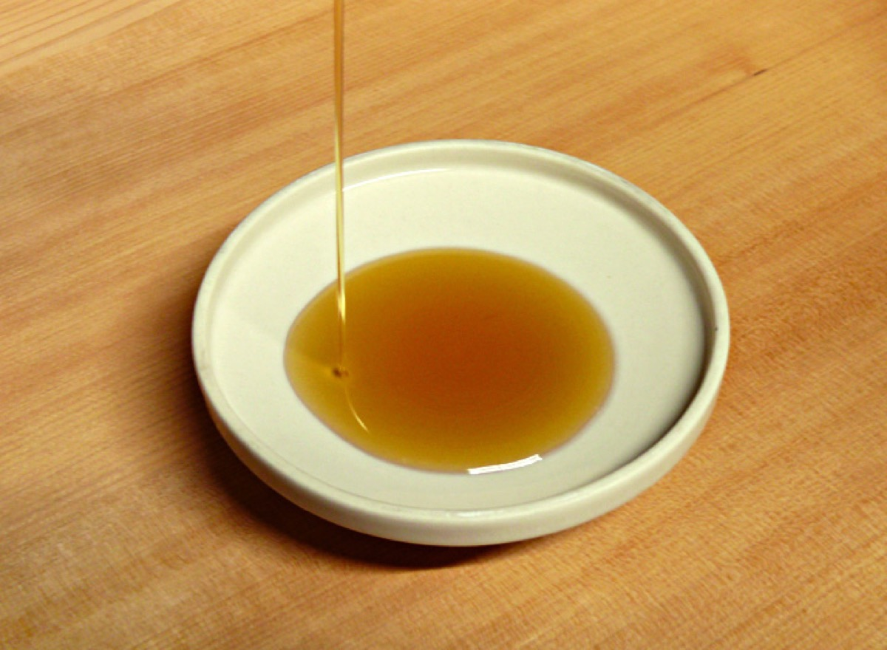

# Oil Pulling

[TOC]

**Oil pulling**<ref name="Oil pulling/> or **oil swishing** is a traditional folk remedy where oil is "swished" (kavala graha) or "held" (snigda gandoosha) in the mouth.

Practitioners of oil pulling claim it is capable of improving oral and systemic health, including a benefit in conditions such as headaches, migraines, diabetes mellitus, asthma, and acne, as well as whitening teeth. Its promoters claim it works by "pulling out" toxins, which are known as ama in Ayurvedic medicine, and thereby reducing inflammation.

Oil pulling has received little study and there is limited evidence to support
claims made by the technique's advocates. In one small study, sesame oil was found to be effective at reducing plaque and oral bacterial load, but was less effective than chlorhexidine (an antiseptic mouthwash); the health claims of oil pulling have otherwise failed scientific verification or have not been investigated.Oil pulling is controversial amongst Western health practitioners. The National Center for Health Research states that "it's still unclear whether or how the practice actually works to get rid of bad bacteria in our mouths. It's also unknown what the long term effects on oral and overall health may be."

## **Traditional usage**
In traditional Ayurveda, gargling treatments like kavala graha and gandusha are used to treat imbalances of various doshas.Ayurveda does not recommend general treatments blindly for everyone, but, rather, health is held to be very individualistic, and the dominant dosha in both the individual and nature determines health care, including dental health.As per Ayurvedic literature, sesame oil is one among many medicinal fluids recommended for daily preventive use and/or seasonal use to reduce dryness (vata dosha) of the mouth and reduce inflammation and burning sensation in the mouth.In case of specific issues, Ayurvedic practitioners might also suggest other treatments such as coconut oil and sunflower oil or other herbalized oils after proper diagnosis of the specific ror dosha.

## References

## References

1. ["wikipedia"](https://en.wikipedia.org/wiki/Oil_pulling)
