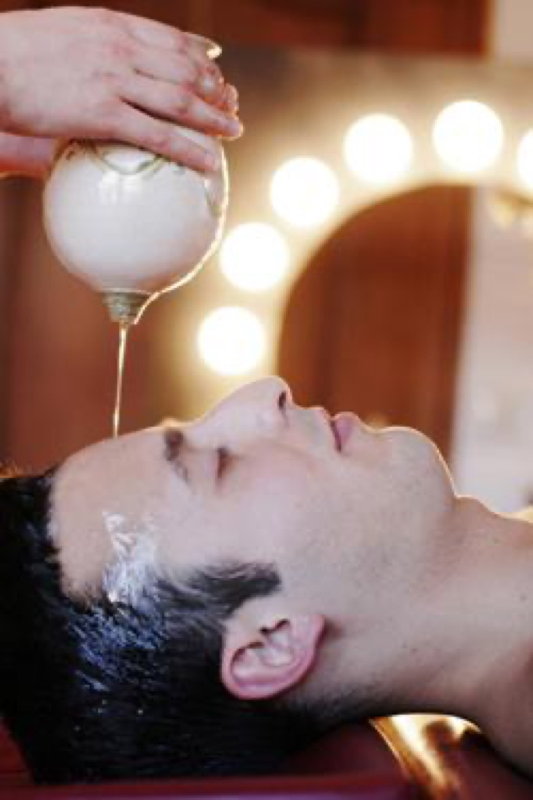

# Panchakarma

[TOC]

*Panchakarma*  ("Pancha" means five and "karma" means treatment) is done to detoxify the body according to Ayurveda. The five procedures are claimed to eliminate the vitiated Doshas from the body. They are Vamana (Emesis), Virechana (Purgation), Niroohavasti (Decoction enema), Nasya (Instillation of medicine through nostrils), and Anuvasanavasti (Oil enema). Nirooha, Anuvasana and Uttaravasthi form the basic types of Vasti. The term Panchasodhana includes Vamana, Virechana, Nasya, Nirooha, and Rakthamoksha (Blood letting).
Pre Panchakarma procedures

**It is important to prepare the body before carrying out these Pancahkarmas. **

The following process is followed before carrying out the Panchakarma procedure.
1. Snehana: Snehana means Oleation or to make smooth. (मार्दव)
1. Swedana: This procedure is very important to liquefy the vitiated Doshas inside the body (which are already made soft by oleation / स्नेहन procedure), later to be brought to Koshtha (कोष्ठ), which will be eliminated by inducing either Vamana / Virechana.

## ***The Procedure of Panchakarma***
**Abhyanga** (Sanskrit: अभ्यंग or अभ्यङ्ग "oil massage") is a form of Ayurvedic medicine that involves massage of the body with large amounts of warm oil. The oil is often pre-medicated with herbs for specific conditions. Abhyanga can be done as part of the steps of panchakarma therapy, especially in the first stage: Purva Karma (pre-treatment), or as its own therapy.
It is often followed by [svedana](svedana.md) therapy, a warm bath, yoga or laying out in the sun. Many times abhyanga is performed by two or more massage therapists working in sync but it can also be done by oneself. Oils used can vary depending on the season and the individuals constitution (prakrti) but commonly used oils include sesame, coconut, sunflower, mustard and almond. In addition to the oil abhyanga massage differs from many Western massage techniques in that it is not very deep.

**Vamana Karma**, also known as medical emesis or medical vomiting, is one of the five Pradhana Karmas of Panchakarma which is used in treating Kaphaj disorders.
Some clinical trials have used it as a treatment for depressive disorder.Some studies have shown its effectiveness for disorders of various systems of human body.It is used as a treatment for psoriasis.There are studies for its use in young prediabetics.The majority of the studies reviewed showed positive outcomes for panchakarma and allied therapies when compared to a control. Unfortunately, only a limited number of high-quality clinical trials have been conducted to date. Common limitations include low sample size, inadequate descriptions of randomization and blinding protocols, inadequate descriptions of adverse events, and nonstandard outcome measures. In spite of this, preliminary studies support the use of panchakarma and allied therapies and warrant additional large-scale research with rigorously designed trials.

**Virechana** is also known as medical purgation(cleansing). It is one of the Panchakarmas. Its clinical trials have been carried out for bronchial asthma, psoriasis, diabetes. But no conclusive evidence has been found out that it works.
According to Ayurvedic claims, Virechana is the best line of management for skin disorders.

**Basti** is treatment done with medicinal substances, like herbal oils and decoctions in a liquid medium, into the rectum of the person. This is one of the five Pradhana Karmas of Panchakarma.
*Basti* is used to treat **vata** disorders.

**Nasya** is a kind of Panchakarma treatment for body cleansing a used in Ayurvedic medicine. Administration of drugs by the route of nasal cavity is termed as nasya, nāvana, nasya karma, etcetera are synonymous to nasya. Randomized controlled clinical trials have shown reduction in the signs and symptoms of cervical spondylosis by nasya.Clinical trials of nasya have been carried out for myopia.Pradhamana nasya is used by ayurvedic physicians and have been found useful to treat chronic sinusitis.

**Shirodhara** is a form of Ayurveda therapy that involves gently pouring liquids over the forehead and can be one of the steps involved in Panchakarma. The name comes from the Sanskrit words shiro (head) and dhara (flow). The liquids used in shirodhara depend on what is being treated, but can include oil, milk, buttermilk, coconut water, or even plain water.
Shirodhara has been used to treat a variety of conditions including eye diseases, sinusitis, allergic rhinitis, greying of hair, neurological disorders, memory loss, insomnia, hearing impairment, tinnitus, vertigo, Ménière's disease and certain types of skin diseases like psoriasis. It is also used non-medicinally at spas for its relaxing properties.
There are specialized forms of shirodhara called ksheeradhara, thakradhara, taildhara and jaladhara.

**SNEHANA**
Snehana is an important procedure which is considerd as poorvakarma to panchakarma therapy
snehana denote oily substance and therapy which is done using sneha is considered as snehana.

        ETHYMOLOGY - स्निह् धातु , ल्युट् प्रत्यय
                     THE WORD SNEHANA HAS TWO MEANING
                     1)Means to render the effection
                     2)Means to render lubrication

        DEFINITION
                   स्नेहनं  स्नेह विष्यन्दं मर्धवं क्लेद कारकं (charaka sutra 22/11)
              This is the procedure in which that bring unctiousness, liquification,softness and moistness to the body

        SNEHA YONI (SOURCES)
              Sneha dravya  is obtained mainly from two sources
                1)स्थावर- Plant sources
                2)जाङ्गम- Animal sources
        The plant sources are ;
                1)तिल(Sesamum indicum)
                2)अतसि(Linum usitatissimum)
                3)प्रियाल(Buchanania lanzan)
                4)बिभितक(Terminalia  belerica)
                5)अभय(Terminalia chebula)
                6)एरण्(Ricinus communis)
                7)सर्षप(Brassica nigra)
                8)बिल्व(Aegle marmelos)
                9)शिग्रु (Moringa oleifera)
                10)करञ्ज(Pongamia pinnata)
        The animal sources are ;
                    सर्पिस्त्तैल वस मज्ज  स्नेह  उधिष्टस्चतुर्विदा (charaka sutra 1/86)

        Propertiies of sneha  ;
                    गुरु शीत सर स्निग्धा मन्द सूक्ष्म मृदु द्रव......(As.Hr.Su.16/1)
              It is having properties like heavy,cold,tendency to flow,unctuous,sluggish,subtle,soft and liquid.

        According to combination;
                1)यमक स्नेह;It is the combination of 2 sneha dravya.
                2)त्रिव्र्त् स्नेह;It is the combination of 3 sneha dravya.
                3)महा स्नेह ;It is the combination of 4 sneha dravya.
                4)अच्छपान स्नेह;Plain sneha which is not processed in agni.
## References

### External Links
[Shirodhara on Science and Technology](https://www.thehindubusinessline.com/business-tech/is-there-science-in-shirodhara/article37855400.ece)

## References

1. [Wikipedia](https://en.wikipedia.org/wiki/Panchakarma)
2. [Wikipedia](https://en.wikipedia.org/wiki/Abhyanga)
3. [Wikipedia](https://en.wikipedia.org/wiki/Vamana_(Panchakarma))
