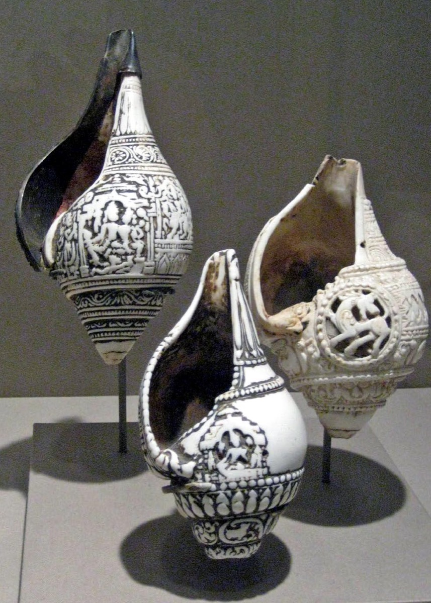

# Shankha

[TOC]

A *Shankha* is a conch shell of ritual and religious importance in Hinduism and Buddhism. It is the shell of a large predatory sea snail,Turbinella pyrum found in the Indian Ocean.

In Hindu mythology, the shankha is a sacred emblem of the Hindu preserver god Vishnu. It is still used as a trumpet in Hindu ritual, and in the past was used as a war trumpet. The shankha is praised in Hindu scriptures as a giver of fame, longevity and prosperity, the cleanser of sin and the abode of Lakshmi, who is the goddess of wealth and consort of Vishnu.

The shankha is displayed in Hindu art in association with Vishnu. As a symbol of water, it is associated with female fertility and serpents (Nāgas). The shankha is the state emblem of the Indian state of Kerala and was also the national emblems of the Indian princely state of Travancore, and the Kingdom of Cochin.

The shankha is one of the eight auspicious symbols of Buddhism, the Ashtamangala, and represents the pervasive sound of Buddhism.

A powder made from the shell material is used in ayurveda, primarily as a cure for stomach ailments and for increasing beauty and strength.

In the Western world, in the English language, the shell of this species is known as the "divine conch" or the "sacred chank". It may also be simply called a "chank" or conch. The more common form of this shell is known as "left-turning" in a religious context, although scientists would call it "dextral". A very rarely encountered form has reverse coiling which is called "right-turning" in a religious context, but is known as "sinistral" or left-coiling in a scientific context.

## References

## References

1. ["wikipedia"](https://en.wikipedia.org/wiki/Shankha)
