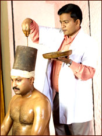

# Sirovasti

The treatment consists of keeping the prescribed medicated oil at a bearable temperature in a leather cap fitted around the head of the patient.The oil is filled in the cap up to a level of one finger above the crown of the head.The duration of treatment is between one and one and half hours.

Sirovasti is an important procedure which is found to be very effective in trigiminal neuralgia, hemicrania, optic atrophy, otalgia, deafness, facial paralysis and in all diseases affecting cranial nerves . Generally the course of treatment is only seven days at a stretch.
