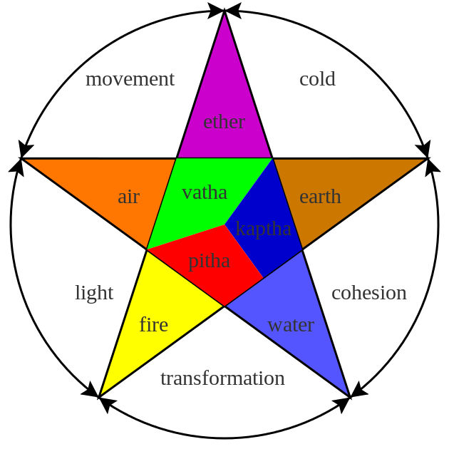

# Tridosha

[TOC]

A dosha (Bioelements), according to Ayurveda, is one of three bodily Bioelements that make up one's constitution. These teachings are also known as the Tridosha theory. The three bioelements are always fluctuating in the body. They are highly unstable and changes with day and night, and with food.

The central concept of Ayurvedic medicine is the theory that health exists when there is a balance between three fundamental bodily bio-elements or doshas called Vata, Pitta and Kapha.

* Vāta or Vata (airy element). It is characterised by properties of dry, cold, light, minute, and movement. All movement in the body is due to property of vata. Pain is the characteristic feature of deranged vata. Some of the diseases due to vata is windy humour, flatulence, gout, rheumatism, etc.
* Pitta is the fiery element or bile that secreted between the stomach and bowels and flowing through the liver and permeating spleen, heart, eyes, and skin; It is characterised by hotness, moist, liquid, sharp and sour, its chief quality is heat. It is the energy principle which uses bile to direct digestion and enhance metabolism. It is primarily characterised by body heat or burning sensation and redness
* Kapha is the watery element, it is characterised by heaviness, cold ,tenderness, softness, slowness, lubrication, and the carrier of nutrients. It is nourishing element of the body. All the soft organs are made by kapha, it plays an important role in taste perception, Joint nourishment and lubrication

## References

## References

1. ["wikipedia"](https://en.wikipedia.org/wiki/Dosha)
