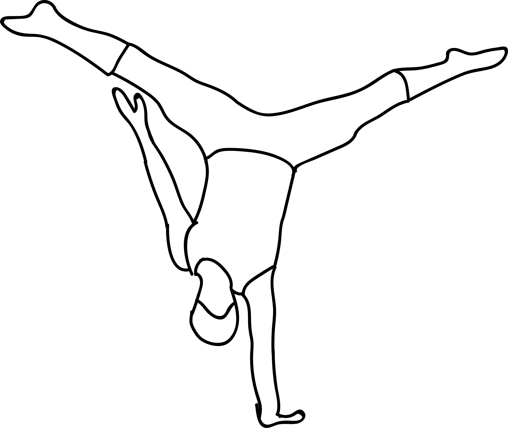

# Adho Mukha Vrikshasana

[TOC]

**Adho Mukha Vrksasana** is one of the most challenging balancing asanas in yoga. This name is derived from the Sanskrit **Adho**, meaning **Downward**, **Mukha**, meaning **facing**, and **Vrksasana**, meaning **Tree pose**. It is named as such because it is an inversion of tree pose. Rather than balancing on the feet and lifting the arms to the sky, the practitioner balances on the hands and lifts the feet.

## Technique
1. To begin this asana, you must start with the Adho Mukha Svanasana or the Downward Facing Dog Pose.
1. If you are a beginner and are practicing with the support of a wall, make sure your hands are placed about six inches away from the wall.
1. Walk towards your hands, making sure your shoulders are placed exactly over your wrists.
1. Bend the knee of any one leg, and lift the foot of the other leg off the floor. Straighten the leg once you are comfortable.
1. Then, as the vertical leg takes the support of the wall, gently lift up the other leg. Hold until you are comfortable.
1. While you do this, you must make sure your head is between your upper arms.
1. Now, try and take your feet off the wall. Engage your legs. Setting your gaze on a certain point on the floor will also help.
1. Hold the pose for a minute or more. Breathe deep and slow.
1. To release this asana, bring your legs down, one at a time. Relax!

## Technique in pictures/animation
## Effects
1. It makes the wrists, arms, and shoulders strong.
1. The belly is given a good stretch.
1. Practicing this asana improves your sense of balance.
1. Blood circulation is enhanced all over the body.
1. The brain is calmed and relaxed.
1. This asana helps relieve stress and mild depression.

## Related Asanas
* [Sirsasana](../yoga/Sirsasana.md)
* [Pincha Mayurasana](../yoga/Pincha_Mayurasana.md)

## Special requisites
Patients suffering from below mentioned conditions should avoid doing Adho Mukha Vrksasana
* Shoulder injuries
* Neck injuries
* Back injuries
* Headahe
* Head deseases
* high blood pressure

## Initial practice notes
As beginners, it might be hard to straighten your elbows when you are in this pose. To get this right, you could use a strap. Buckle it up and loop it over the upper arms, just above the elbows. Stretch out your arms such that they are shoulder-width apart. As you do this, make sure the strap snugly fits on the outer arms. Then, use the strap to straighten the elbows. But make sure you push your arms away from the strap while in the asana.

## References

## External Links
* [Adho Mukha Vrksasana on yogajournal.com](https://www.yogajournal.com/practice/yogapedia-challenge-pose-handstand-adho-mukha-vrksasana)
* [Adho Mukha Vrksasana on tummee.com](https://www.tummee.com/yoga-poses/adho-mukha-vrksasana)
* [Adho Mukha Vrksasana on bradpriddy.com](http://www.bradpriddy.com/yoga/handst.htm)

## References

1. [To Do The Adho Mukha Vrksasana"]("How)(http://www.stylecraze.com/articles/handstand-pose-adho-mukha-vrksasana/#TheBenefitsOfTheHandstand)
2. [Benefits"]("Health)(http://www.yogawiz.com/articles/4/yoga-asana-benefits/benefits-and-importance-of-adho-mukha-vrksasana.html)
