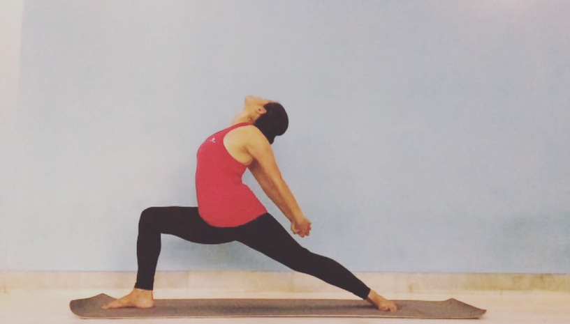

# Anahata Chakra Baddha Hasta Virabhadrasana

[TOC]

The **Anahata Chakra / Heart Chakra** located in the chest region, is our energy point of love. When we mindfully practice Asanas that open our Anahata Chakra, we trigger the process of emotional healing.

## Technique
1. Begin with Adho Mukha Svanasana / Downward Dog.
1. Inhale and lift your right leg up. Point your toes towards the ceiling and keep your knee straight.
1. Exhale and come into Ashwa Sanchalanasana / The Equestrian Pose.
1. Inhale and lift your torso up.
1. Stretch your arms forward and slowly come into Virabhadrasana / Warrior Pose (Type 1).
1. Stay in this pose for 3 long breaths.
1. Inhale and stretch your arms sideways.
1. Bring your arms behind your back and interlace your fingers.
1. Stretch your arms to open your shoulder blades.
1. Inhale and bend back as much as you can till your chest faces the ceiling.
1. Stay in this pose for 3 to 6 long breaths.

## Technique in pictures/animation
## Effects
* Stimulates abdominal organs, ovaries and prostate gland, bladder, and kidneys.
* Stimulates the heart and improves general circulation Stretches the inner thighs, groins, and knees.
* Helps to relieve mild depression, anxiety, and fatigue Soothes menstrual discomfort and sciatica Helps relieve the symptoms of menopause Therapeutic for flat feet, high blood pressure, infertility, and asthma Consistent practice of this pose until late into pregnancy is said to help ease childbirth. * Traditional texts say that Baddha Konasana destroys disease and gets rid of fatigue.

## Related Asanas
* [Veera bhadrasana](Veera_bhadrasana.md)

## Special requisites
Patients suffering from below mentioned conditions should avoid doing Anahata Chakra Baddha Hasta Virabhadrasana.
* Anyone suffering from high blood pressure, heart problems, head, shoulder or neck injuries.

## Initial practice notes
Beginners can use props, although Anahata Chakra Baddha Hasta Virabhadrasana is not a tough Asana. Beginners may use wall support for maintaining body balance during performing this Asana.

## References

## External Links
* [Anahata Chakra Baddha Hasta Virabhadrasana on 365dayspact.wordpress.com](https://365dayspact.wordpress.com/2017/04/11/anahata-chakra-baddha-hasta-virabhadrasana-open-heart-chakra-hands-bound-warrior-pose-open-up-your-heart/)
* [Anahata Chakra Baddha Hasta Virabhadrasana on wish4me.com](http://wish4me.com/anahata-chakra-baddha-hasta-virabhadrasana-benefits/)

## References

1. [of Anantasana"]("Methodology)(https://365dayspact.wordpress.com/2017/04/11/anahata-chakra-baddha-hasta-virabhadrasana-open-heart-chakra-hands-bound-warrior-pose-open-up-your-heart/)
2. [of Anantasana"]("Benefits)(http://wish4me.com/anahata-chakra-baddha-hasta-virabhadrasana-benefits/)
