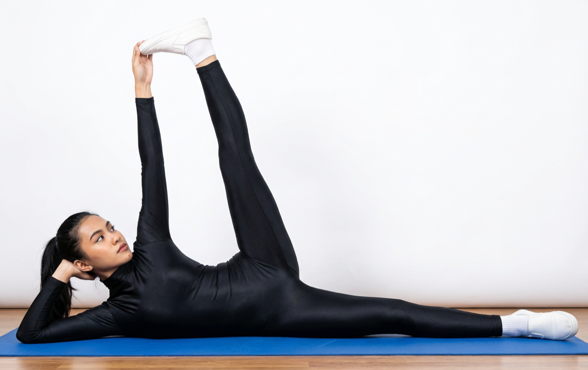

# Anantasana

[TOC]

The name **Anantasana** is made of two separate Sanskrit words ‘Anant’ and ‘Asana’. While Asana just means posture or exercise, Anant means endless, never ending and infinite. It can also mean a future event. In Hindu mythology, the god Vishnu has the name ‘Anant'. There are popular images of Lord Vishnu lying in a reclining pose on his side on top of a snake. This is how this yoga pose, which looks like Vishnu’s posture, has got its name.

## Technique
1. Lie flat on your mat and gently turn to the left. Steady yourself as you take this position by pressing the outer part of your left foot and your heels firmly into the floor.
1. Raise your right arm over your head. Make sure that your arm is perpendicular to your body.
1. Use your left arm to support your head as you lift it off the floor and support it on your palms.
1. Bend your right leg at the knee, and reach for your big toe with the right arm. Grab it using the first two fingers and the thumb.
1. Stay stable for a few seconds as you prepare to maintain balance.
1. Exhale and stretch the right leg towards the ceiling. Stretch as far as you can, ensuring your arm and leg are perfectly straight.
1. Hold this pose for a few seconds. Then, release. Wait for a few moments. Repeat this pose as you turn to your right side, and do it with your left leg for the same amount of time.

## Effects
* This pose can be advantageous to people trying out to modify the habit of sleeping on only one side of their body.
* Anantasana/Vishnu’s Couch Pose cures the back-ache problem.
* Anantasana/Vishnu’s Couch Pose  prevents growing of a hernia
* This asana strengthens the pelvic muscles
* The Anantasana /Vishnu’s Couch Pose(the sleeping Vishnu Pose) may meliorate blood circulation of the body.
* Anantasana /Vishnu’s Couch Pose improves  balancing of the body, pelvis, hip & leg adductor muscle
* Anantasana / Vishnu’s Couch Pose strengthens the belly, increases hip mobility, and may help oneself bring down low backbone pain.
* This pose meliorates counterbalance and coordination, as likewise growing bigger focus and concentration. Carrying equilibrium in this posture demands a calmness and clean mind. Adopting this power may help oneself to bring down tension, anxiousness, and intellectual tiredness.

## Related Asanas
* [Adho Mukha Svanasana](../yoga/Adho_Mukha_Svanasana.md)

## Special requisites
* These are some points of caution you must keep in mind before you do this asana.
* Avoid practicing this asana if you have pain in your neck or shoulders.
* If you have spondylitis, slip disc, or sciatica, you must make sure you practice this asana only under the guidance of an experienced teacher.

## Initial practice notes
* Beginners can use props, although Anantasana is not a tough Asana. Beginners may use a wedge/bolster to your back for maintaining body balance during performing this Asana

## References

## External Links
* [Anantasana on jaisiyaram.com](http://www.jaisiyaram.com/yoga-poses/anantasana.html)
* [Anantasana on stylesatlife.com](http://stylesatlife.com/articles/anantasana/)
* [Anantasana on boldsky.com](https://www.boldsky.com/health/wellness/2016/anantasana-side-reclining-leg-lift-to-lose-hip-and-thigh-weight-104677.html)

## References

1. ["Methodology"](http://www.stylecraze.com/articles/anantasana-how-to-do-and-what-are-its-benefits/#HowToDoTheAnantasana)
2. [tips"]("Beginers)(https://www.sarvyoga.com/anantasana-infinite-yoga-pose/)
3. ["Benefits"](http://simpleyogaathome.com/anantasana-vishnus-couch-pose/)
