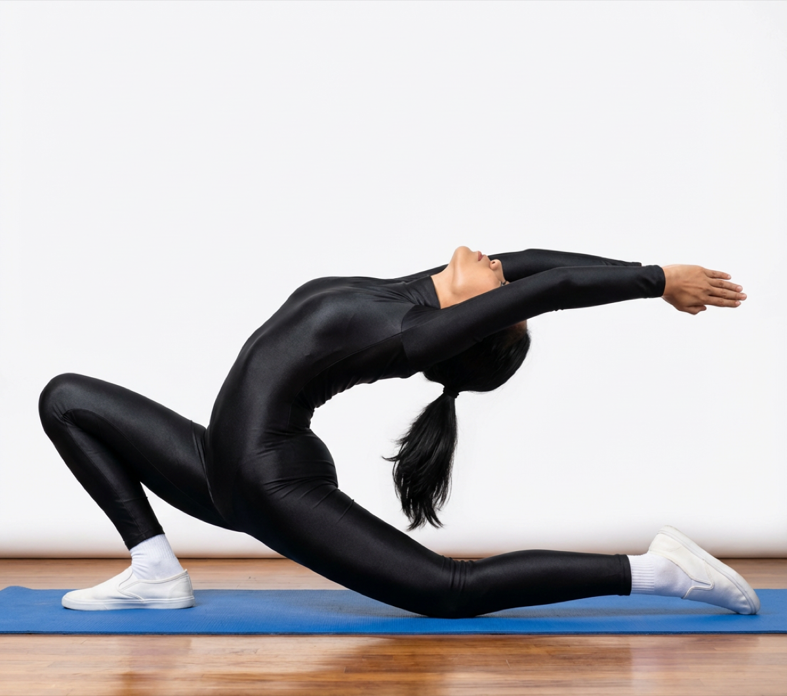

# Anjaneyasana

[TOC]

**Anjaneya** is the Sanskrit word which signifies “Child of Anjani” and Anjayneya is another name for Hindi God Hanuman in Hindu Mythology. Hanuman is Ram’s associate in Ramayana. God Hanuman helped ruler Rama to get back Mata Sita from Ravana’s place called Lanka. Low Lunge Pose gets its name from the state of body frames amid asana.

## Technique
1. Begin the asana by coming into the Adho Mukha Svanasana. Once you are in the pose, exhale and place your right foot in front, just beside your right hand. Make sure your right knee and ankle are in one line.
1. Gently lower the left knee, placing it on the floor, right behind your hips.
1. Inhale, and lift your torso. Then, raise your arms above your head, such that your biceps are next to your ears, and your palms are facing each other.
1. Exhale. Let your hips settle down and forward, such that you feel a good stretch in the frontal region of your leg and the hip flexors.
1. Pull your tailbone towards the ground. Extend your lower back as you engage your spine. Stretch your arms further behind so that your heart is pushed up. Look behind as you move into the mild backbend.
1. Hold the pose for a few seconds. You can also raise the knee of the back leg off the mat to come into a full crescent pose.
1. To release the pose, place your hands back on the mat, and move into the Adho Mukha Svanasana. Repeat the pose with your left leg forward.

## Effects
* Anjaneyasana makes the gluteus muscles and the quadriceps stronger.
* It gives the hips and hip flexors a good stretch.
* It opens up your shoulders, lungs, and chest.
* Low Lunge Pose helps you improve your balance.
* Increases your ability to concentrate and also builds core awareness.
* Anjaneyasana helps relieve sciatica.
* Low Lunge Pose stimulates the digestive and reproductive organs.
* If you practice this asana regularly, your body will be toned and energized..

## Related Asanas
* [Virabhadrasana I](../yoga/Virabhadrasana_I.md)
* [Virabhadrasana II](../yoga/Virabhadrasana_II.md)

## Special requisites
These are a few points of caution you must keep in mind before you do the Anjaneyasana.
Avoid this asana if you have the following problems:

* High blood pressure
* Knee injuries
* If you have shoulder problems, avoid raising your arms above your head. You could place your hands on your thighs instead.
* If you have a problem in your neck, do not look behind. Instead, set your gaze forward.

## Initial practice notes
While this exercise may be difficult for a beginner to perform there are a few tips which can make the execution of it easier. One beginner’s tip for Low Lunge is to face a wall and practice this pose. This will help to improve the beginner’s balance. The big toe of the foot that is in front should be pressed against the wall and the arms should be stretched upwards with the fingers touching the wall as well.

## References

## External Links
* [Anjaneyasana on healthlogus.com](https://www.healthlogus.com/anjaneyasana-low-lunge-pose/)
* [Anjaneyasana on rddu entertainment.com](http://www.rdduentertainment.com/anjaneyasana-low-lunge-pose-steps-benefits-amd-precautions/)
* [Anjaneyasana on dolittleyoga.com](http://www.dolittleyoga.com/pose-steps-and-benefits-of-anjaneyasana/)

## References

1. [of Anantasana"]("Methodology)(http://www.stylecraze.com/articles/anjaneyasana-low-lunge-pose-crescent-moon-pose/#HowToDoTheAnjaneyasana)
2. [tips"]("Beginers)(http://www.yogawiz.com/yoga-poses/standing-poses/low-lunge.html)
3. [of Anantasana"]("Benefits)(https://www.sarvyoga.com/anjaneyasana-low-lunge-pose-steps-and-benefits/)
