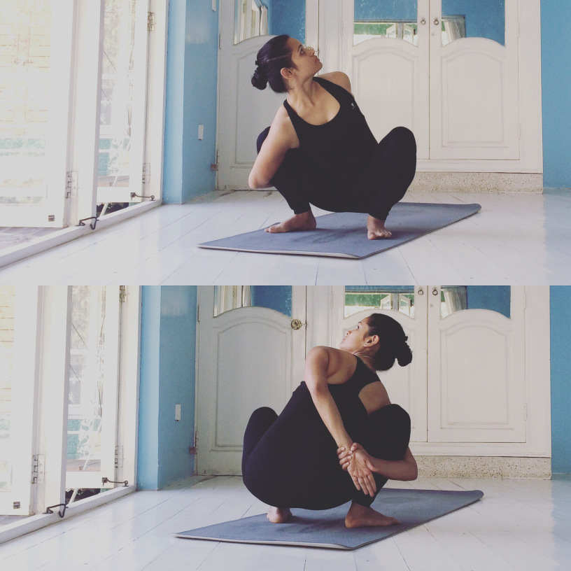

# Ardha Baddha Parivrtta Malasana

[TOC]

**Ardha Baddha Parivrtta Malasana** is an Asana. It is translated as Half Bound Revolved Garland Pose from Sanskrit.The name of this pose comes from "ardha" meaning "half", "baddha" meaning "bound", "parivrtta" meaning "revolved", "mala" meaning "garland", and "asana" meaning "posture" or "seat". This pose is a variation of Malasana.

## Technique
1. Start by doing squatting. During this, put your feet near to each other, with your heels on the ground or supported on the floor.
1. Now stretch out your thighs, putting them smoothly wider than your torso.
1. Breathe out and bend forward in a way that your torso fits comfortably in between your thighs.
1. Now make Anjali Mudra (Namaste posture) by your palms, by your elbows make some pressure against the inner thighs. By this the front part of your torso is stretched.
1. Then press your inner thighs against the side of the middle (torso). At that point, extend your arms, and swing them crosswise over with the end goal that your shins fit into the armpits. Hold your lower legs (Ankles).
1. Remain in the pose for 60 seconds. Breathe in and release the pose.

## Effects
* Stretches and strengthens the shoulders, neck and lower back.

* Stretches the hips and groins.

* Improves metabolic rate.

* Strengthens the feet, ankles, calves and knees.

* Tones the abdomen.

## Related Asanas
* [Malasana](../yoga/Malasana.md)

## Special requisites
* Anyone suffering from severe knee, hip, shoulder or neck injuries.

## Initial practice notes
Before you begin this practice, sit in a comfortable cross-legged position for 5 to 10 minutes. Place your attention on your natural breath to create a home base for your mind. Whenever your attention strays, bring it back to the breath.

## References

## External Links
* [Ardha Baddha Parivrtta Malasana on ipfs.net](https://ipfs.io/ipfs/QmXoypizjW3WknFiJnKLwHCnL72vedxjQkDDP1mXWo6uco/wiki/Ardha_Baddha_Parivrtta_Malasana.html)
* [Ardha Baddha Parivrtta Malasana on tummee.com](https://www.tummee.com/yoga-poses/ardha-baddha-padma-paschimottanasana-variation-parivrtta)

## References

1. [of Anantasana"]("Methodology)(https://www.sarvyoga.com/malasana-garland-yoga-pose-steps-and-benefits/)
2. [tips"]("Beginers)(https://www.yogajournal.com/practice/a-beautiful-bind)
3. [of Anantasana"]("Benefits)(https://365dayspact.wordpress.com/2017/11/29/ardha-baddha-parivrtta-malasana-half-bound-wide-squat-pose-variation-get-the-weight-off-your-shoulders/)
