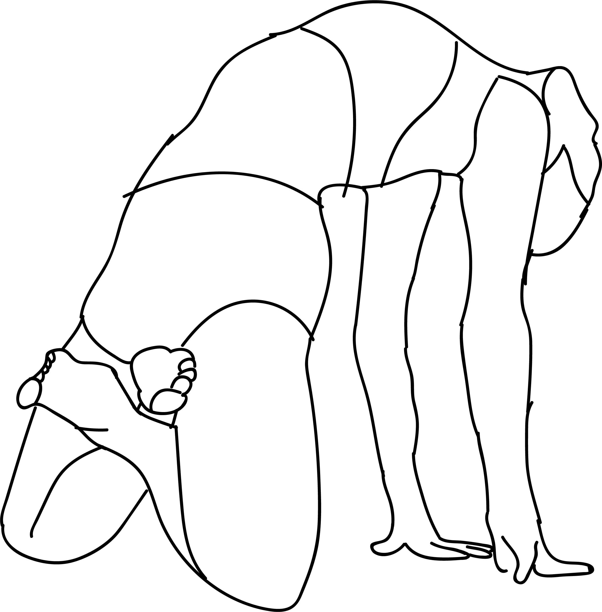

# Ardha Kamalamunyasana

[TOC]

**Ardha Kamalamunyasana** is an Asana. It is translated as Half Pose Dedicated to Siddhar Kamalamuni from Sanskrit. The name of this pose comes from **ardha** meaning **half**, **Kamalamuni** referring to one of the Siddhars, and asanas meaning **posture** or **seat**.

## Technique
1. Begin with Dandasana / Staff Pose.
1. Exhale and come into Padmasana / Lotus Pose.
1. Place your palms a few inches behind your sitting bones.
1. Inhale and slowly lift your tailbone, buttocks and thighs (as one unit) towards the ceiling.
1. Balance your body weight on your palms and knees.
1. Stretch your chest and shoulders as much as you can.
1. Focus in between your eyebrows (Ajna Chakra).
1. Stay in this pose for 3 to 6 long breaths.

## Effects
* Calms the mind.
* Improves concentration and sense of balance.
* Relieves stress, anxiety and depression.
* Improves lung capacity.
* Stretches and strengthens the spine.
* Stimulates all your Chakras / Energy Points.
* Massages the abdominal organs.
* Stimulates the reproductive system.
* Strengthens the knees, ankles, hips, wrists, arms and shoulders.
* Boosts your immune system.

## Related Asanas
* [Kamalamunyasana](Kamalamunyasana.md)

## Special requisites
Anyone suffering from severe back, hip, knee, wrist or shoulder injury.

## Initial practice notes
## References

## External Links
* [Ardha Kamalamunyasana on 365dayspact.wordpress.com](https://365dayspact.wordpress.com/2017/04/27/ardha-kamalsmunyasana-half-pose-dedicated-to-siddhar-kamalamuni-take-it-up-a-notch/)

## References

1. ["Methodology"](https://365dayspact.wordpress.com/2017/04/27/ardha-kamalsmunyasana-half-pose-dedicated-to-siddhar-kamalamuni-take-it-up-a-notch/)
2. [benefits"]("Health)(https://365dayspact.wordpress.com/2017/04/27/ardha-kamalsmunyasana-half-pose-dedicated-to-siddhar-kamalamuni-take-it-up-a-notch/)
