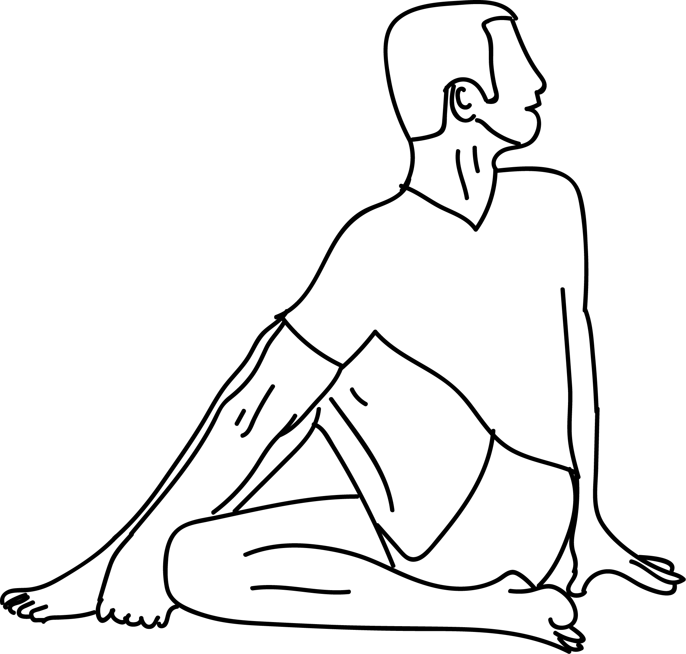

# Ardha Matsyendrasana

[TOC]

**Ardha Matsyendrasana** also known as the Half Lord of The Fish pose, Half Spinal Twist Pose, is derived from the Sanskrit terms ardha (half), matsya (fish), indra (King or Lord). Ardha Matsyendrasana is one of the best twisting postures. The entire spine gets rotated around its axis. Moreover, your spine also gets two side twists throughout its length. The levers used for these extreme twists are the arms and the knees.
## Technique
1. Sit with an extended spine and your legs extended out in front.
1. Bend your right knee and cross your foot over your left thigh.
1. Bend your left knee and bring your left heel to your outer right hip. Keep your right foot on the inside of your left knee if your right foot lifts off the floor.
1. Place your right fingertips on the floor next to your right hip, and inhale as you elongate your spine.
1. Hold the extension and exhale as you twist towards the right, rotating from your back left ribs. Use the twisting action itself to go deeper; avoid hooking your elbow right away and using the arm for leverage. Instead, wrap your left arm lightly around your knee while lengthening with each inhale. Exhale to twist more.
1. Bring your elbow outside your knee. Allow your arms to maintain the length of your spine, despite the urge to collapse due to the pressure of the elbow against your knee.
1. You can turn your head to the right if that feels comfortable.

## Effects
* Good for increasing the flexibility and function of vertebrae of the spine.
* Stretches back muscle and spine.
* Cures constipation and indigestion.
* Helps to increases oxygen supply to the lungs.
* Releases stiffness of hip joints.
* Beneficial for slipped disc patient.
* Cures back problems.
* Increases blood circulation to pelvic region as well as improves the function of reproductive organs.
* Effective to cure menstrual problems in women.
* Helpful in treatment of diabetes, constipation, spinal problems, Cervical Spondylitis, Urinary tract disorder.

## Related Asanas
* [Paschimottanasana](../yoga/Paschimottanasana.md)
* [Janusirsasana](Janusirsasana.md)

## Special requisites
* This asana must be avoided during pregnancy and menstruation as it entails a strong twist at the abdomen.
* People who have recently undergone abdominal, heart or brain surgeries, should not practice this asana.
* Those with a hernia or peptic ulcers must do this asana carefully and under the supervision of a certified yoga instructor.
* People who have a minor slipped disc problem will benefit from this asana. But they must do it under supervision, and with a doctor’s approval.
* If you have a severe spinal problem or a severe slipped disc problem, it is best to avoid this asana.

## Initial practice notes
The many hand variations in this pose can make it quite hard for beginners to adapt. First of all, make sure you sit on a blanket and practice this pose. Next, before you try the hand and arm variations, just wrap one arm around the raised leg, and hug your thigh to your torso. With practice, you can start trying other variations.

## References

## External Links
* [Ardha Matsyendrasana on yogapoint.com](https://www.yogapoint.com/asana/matsyendrasana.html)
* [Ardha Matsyendrasana on sarvyoga.com](https://www.sarvyoga.com/ardha-matsyendrasana-half-spinal-twist-pose-steps-benefits/)
* [Ardha Matsyendrasana on finessyoga.com](http://www.finessyoga.com/yoga-asanas/ardha-matsyendrasana-half-spinal-twist-steps-benefits)

## References

1. [of Anantasana"]("Methodology)(https://arogyayogaschool.com/blog/health-benefits-of-ardha-matsyendrasana/)
2. [tips"]("Beginers)(http://www.stylecraze.com/articles/ardha-matsyendrasana-fish-pose/#Beginner’sTips)
3. [of Anantasana"]("Benefits)(https://eyogaguru.com/ardha-matsyendrasana-half-twist-yoga-pose-benefits-steps/)
