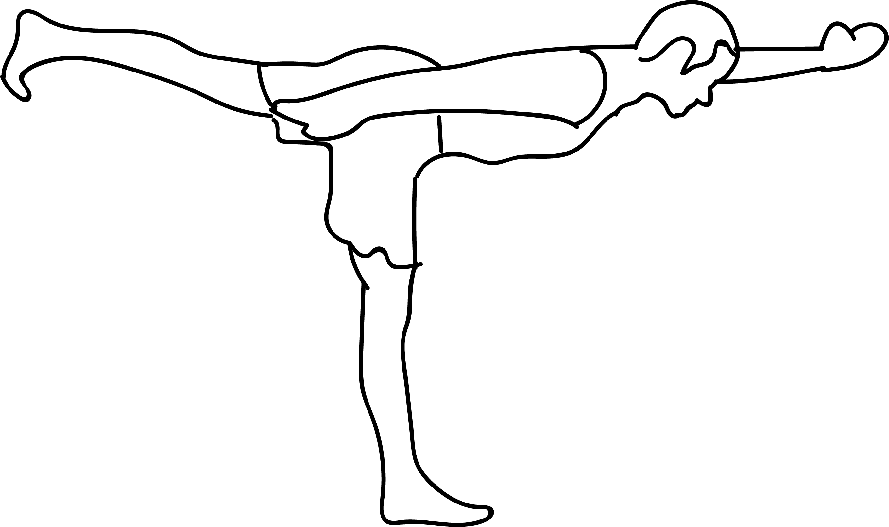

# Ardha Padma Eka Pada Malasana

[TOC]

**Ardha Padma Eka Pada Malasana**  is an Asana. It is translated as Half Lotus One Legged Garland Pose from Sanskrit. The name of this pose comes from **ardha** meaning **half**, **padma** meaning **lotus**, **eka** meaning **one**, **pada** meaning **foot**, **mala** meaning **garland**, and asanas meaning **posture** or **seat**. This pose is a variation of Malasana.

## Benefits and Cautions
* This pose claims the following benefits: it stretched the inside of the thigh and hip, promotes a sense of balance.
* It is recommended to be cautious while doing this pose if you have any knee, ankle, or hip injuries.

## References

## References

1. ["wikipedia"](https://en.wikipedia.org/wiki/Ardha_Padma_Eka_Pada_Malasana)
