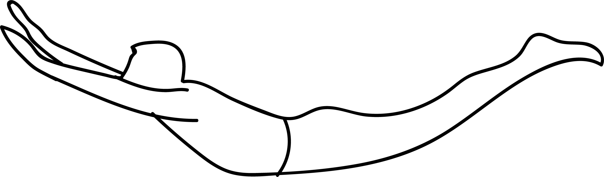

# Baddha Hasta Utthita Stiti Shalabhasana

[TOC]

**Baddha Hasta Utthita Stiti Shalabhasana** is an Asanas. It is translated as Bound Hands Rising Standing Locust Pose from Sanskrit. the name of this pose comes from "baddha" meaning "bound", "hasta" meaning "hand", "utthita" meaning "extended", "sitit" meaning "standing", "shalabha" meaning "locust", and "asana" meaning "posture" or "seat". This pose is a variation of Salabhasana in a standing position in Tadasana.

## Technique
1. While the arms are stretched behind with interlocked fingers, exhale and stretch them deeper downwards while keeping them close to your body.
1. Here throw the neck back in a back bend while the chest is facing the sky or the ceiling.
1. Remain here in Hands Bound Rising Locust Pose for about 2-3 breaths and tighten the chest and the belly.

## Effects
* It opens the front shoulder head and the chest muscles. It promotes spinal flexibility.
* Be careful while doing this pose if you have any spinal or shoulder injuries

## Related Asanas
* [Shalabhasana](Shalabhasana.md)

## Special requisites
* if you have any spinal or shoulder injuries then avoid this pose.

## Initial practice notes
Beginners can use props leke chair, although Baddha Hasta Utthita Stiti Shalabhasana is not a tough Asana. Beginners may use a wedge/bolster to your back for maintaining body balance during performing this Asana.

## References

## External Links
* [Baddha Hasta Utthita Stiti Shalabhasana on ipfs wiki.com](https://ipfs.io/ipfs/QmXoypizjW3WknFiJnKLwHCnL72vedxjQkDDP1mXWo6uco/wiki/Baddha_Hasta_Utthita_Stiti_Shalabhasana.html)
* [Baddha Hasta Utthita Stiti Shalabhasana on tummee.com](https://www.tummee.com/yoga-poses/baddha-hasta-utthita-stiti-salabhasana)
* [Baddha Hasta Utthita Stiti Shalabhasana on sarvyoga.com](https://www.sarvyoga.com/shalabhasana-locust-pose-steps-and-benefits/)

## References

1. [of Baddha Hasta Utthita Stiti Shalabhasana](Methodology)(https://www.tummee.com/yoga-poses/baddha-hasta-utthita-stiti-salabhasana/steps)
2. [of Baddha Hasta Utthita Stiti Shalabhasana](Benefits)(https://ipfs.io/ipfs/QmXoypizjW3WknFiJnKLwHCnL72vedxjQkDDP1mXWo6uco/wiki/Baddha_Hasta_Utthita_Stiti_Shalabhasana.html)
