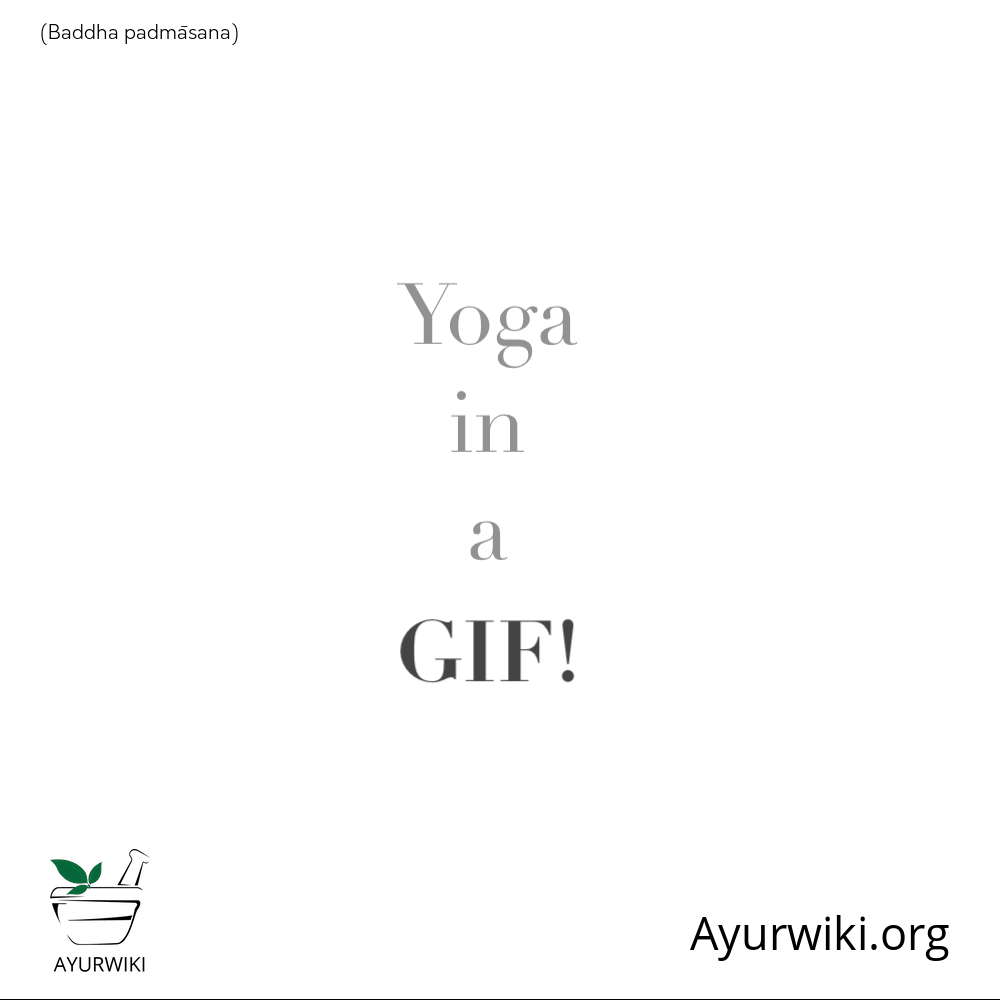

# Baddha padmasana

[TOC]

## Technique
1. Sit in the Padmasana (Lotus Pose), Keep your feet high on your thighs, just close to the groin.
1. Place your right arm behind to your back and reach round till your right hand is close to the left hip.
1. Now bow forward a little; twist your trunk to your right side and try to grasp the right thumb of toe, resting on the left thigh firmly with the index finger and the middle finger.
1. Sit straight and remain in the position for a few seconds.baddha padmasana steps
1. Equivalently, place your left arm behind your back; crossing your right arm and try to reach round till your left hand is close to your right hip.
1. Now bend forward a little. Twist your torso to the left and bring your shoulder blades together, try to grasp the left thumb of toe, resting on the right thigh firmly with the forefinger and the middle finger.
1. Sit straight and remain in the position for a few seconds.
1. Now your arms and legs are tightly locked.
1. Try to keep your head, neck and spine straight.
1. Your knees should press the ground.
1. Look straight forward and breathing normally.
1. It is the final position of Baddha Padmasana.
1. Try to hold this pose for about ten seconds or as long as you can.
1. Now release your hands and open the foot lock and come back to the initial position.
1. Repeat the same process with your alternate legs and hands also

## Effects
* Make your legs flexible.
* It stretches the joints of shoulders, wrists, back, elbows, hips, knees, ankles and makes them more flexible.
* Beneficial in the shoulders and back pain.
* It improves the posture of the spine.
* It increases the range of the shoulder movements.
* It is beneficial in constipation and improves the functions of digestive system.
* Daily practice of this Asana is beneficial in Arthritis.
* Helps to make your spine straight.

## Related Asanas
## Special requisites
## Initial practice notes
## References

## External Links
* [Baddha_padmasana on ayurvedicindia.info](http://www.ayurvedicindia.info/yoga-postures-baddhapadmasana/)
* [Baddha_padmasana on wikipedia.org](https://en.wikipedia.org/wiki/Baddha_padmasana)

## References

1. [Benefits"]("Health)(https://www.sarvyoga.com/baddha-padmasana-locked-lotus-pose-steps-and-benefits/)
