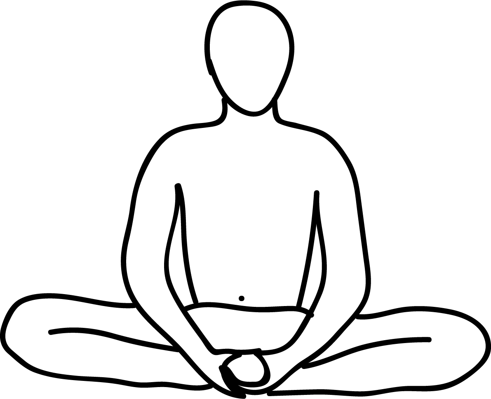

# Baddhakonasana

[TOC]

**Baddha Konasana** (BAH-dah koh-NAH-sah-nah[needs IPA]; Sanskrit: बद्धकोणासन ; IAST: baddhakoṇāsana), Bound Angle Pose, or Cobbler Pose (after the typical sitting position of Indian cobblers when they work) is an [Asanas](../Asanas.md).

## Technique
1. Sit in an erect position on a flat surface and stretch your legs out.
1. Exhale and bend you’re both knees to touch both soles together.
1. While pressing your heals close together try bringing your heals closer to pelvis area.
1. Now grab your big toe of each foot with your thumb and index finger and the middle finger.
1. Never try to force your knee towards the floor, instead, let your head of thigh bone move towards the floor. This will make your knees to move towards floor naturally.
1. You can also move your knees up and down like the wings of a butterfly to increase the range of your hip mobility without putting unnecessary constant pressure on your hip joint.
1. Maintain the position for 1-5 minutes and then inhale and lift your knees away from the floor and straighten your legs back in their original position.

## Effects
* Stimulates abdominal organs, ovaries and prostate gland, bladder, and kidneys
* Stimulates the heart and improves general circulation
* Stretches the inner thighs, groins, and knees
* Helps relieve mild depression, anxiety, and fatigue
* Soothes menstrual discomfort and sciatica
* Helps relieve the symptoms of menopause
* Therapeutic for flat feet, high blood pressure, infertility, and asthma
* Consistent practice of this pose until late into pregnancy is said to help ease childbirth.
* Traditional texts say that Baddha Konasana destroys disease and gets rid of fatigue.

## Related Asanas
* [Padangushtasana](../yoga/Padangushtasana.md)
* [Virasana](../yoga/Virasana.md)
* [Vriksasana](../yoga/Vriksasana.md)

## Special requisites
Take a look at some points of caution while you do this asana:

* It is best to avoid this asana if you have a knee injury.
* Do not practice this asana if you are menstruating.
* If you suffer from sciatica, sit on a pillow and practice this asana.

## Initial practice notes
Lowering your knees such that they sit flat on the floor can be difficult, especially if your knees are high, and your back is rounded. You can sit on a high support to make things easier until you get used to the asana. The support can be as high as one foot away from the floor.

## References

## External Links
* [Baddha Konasana on cnyhealingarts.com](http://www.cnyhealingarts.com/2010/10/15/the-health-benefits-of-baddha-konasana-bound-angle-pose/)
* [Baddha Konasana on doyouyoga.com](https://www.doyouyoga.com/the-holistic-benefits-of-bound-angle-pose-46231/)
* [Baddha Konasana on sarvyoga.com](https://www.sarvyoga.com/baddha-konasana-bound-angle-pose-steps-and-benefits/)

## References

1. [of Baddha Konasana"]("Methodology)(http://www.stylecraze.com/articles/anantasana-how-to-do-and-what-are-its-benefits/#HowToDoTheAnantasana)
2. [tips"]("Beginers)(http://www.stylecraze.com/articles/baddha-konasana-butterfly-pose-cobbler-pose/#Beginner’sTips)
3. ["Benefits"](https://www.yogajournal.com/poses/bound-angle-pose)
