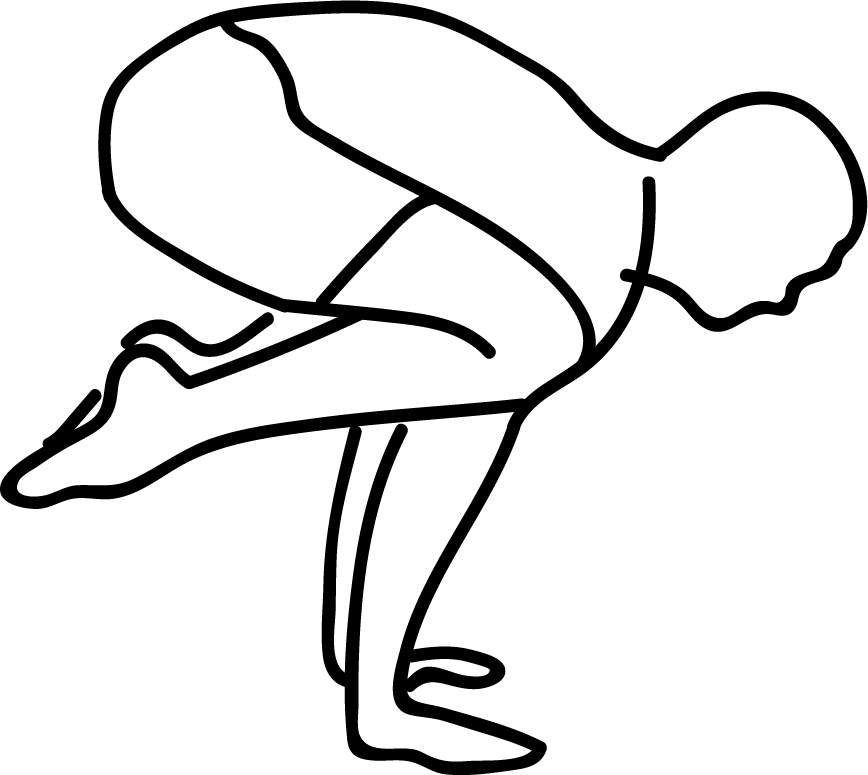

# Bakasana

[TOC]

**Bakasana** or **Crow Pose** is an arm balance with a wide variety of health benefits. Crow Pose, the variation with bent arms, is considered the stepping stone to Crane Pose, the variation with straight arms.
## Technique
1. Stand in the position of Tadasana. after taking the position of Tadasana, come down to the Uttanasana position.
1. While doing Uttanasana, keep your hands on the floor just in front of your feet. For this, you’ll need to bend a little more from your hips.
1. If you’re not capable to balance properly, attempt to keep a folded blanket below your hands so your body gets a platform to rest on.
1. Now Bend your arms a bit (as much as possible). attempt to carry your left leg up in the air.
1. Fold your knee and take a look at to rest your left knee on the outer facet of your left arm.
1. Fold the right leg from the knee and take a look at to put the right knee on the outer facet of the right arm.
1. There ought to be an acceptable distance between each your hands, so it becomes easier for you to balance your body on your hands.
1. Stay steady in this position for concerning 15-20 seconds, after that slowly-slowly release. repeat this process three times a day.

## Effects
* It makes the wrists and the arms stronger
* The spine is toned and strengthened.
* The upper back gets a good stretch.
* This asana improves your sense of balance and focus.
* Your mind and body are prepared for challenges.
* The abdominal region is toned and strengthened. Therefore, this asana aids digestion.
* Your inner thighs become strong.
* Your groin area is opened up.
* With regular practice, you feel strong and confident.

## Related Asanas
* [Adho Mukha Svanasana](../yoga/Adho_Mukha_Svanasana.md)
* [Chaturanga Dandasana](../yoga/Chaturanga_Dandasana.md)
* [Plank Pose](Plank_Pose.md)

## Special requisites
Avoid this pose during:

* Carpal tunnel syndrome
* Pregnancy

## Initial practice notes
Beginners tend to move into this pose by lifting their buttocks high away from their heels. In Bakasana try to keep yourself tucked tight, with the heels and buttocks close together. When you are ready to take the feet off the floor, push the upper arms against the shins and draw your inner groins deep into the pelvis to help you with the lift.

## References

## External Links
* [Bakasana on sarvyoga.com](https://www.sarvyoga.com/bakasana-crane-pose-steps-and-benefits/)
* [Bakasana on doyouyoga.com](https://www.doyouyoga.com/the-holistic-benefits-of-crow-pose-66121/)
* [Bakasana on finessyoga.com](http://www.finessyoga.com/yoga-asanas/bakasana-crow-pose-steps-benefits)
* [Bakasana on 7pranayama.com](https://7pranayama.com/bakasana-steps-crow-pose-benefits/)

## References

1. ["Methodology"](https://www.sarvyoga.com/bakasana-crane-pose-steps-and-benefits/)
2. [tips"]("Beginers)(https://www.yogajournal.com/poses/crane-pose)
3. [of Anantasana"]("Benefits)(http://simpleyogaathome.com/anantasana-vishnus-couch-pose/)
