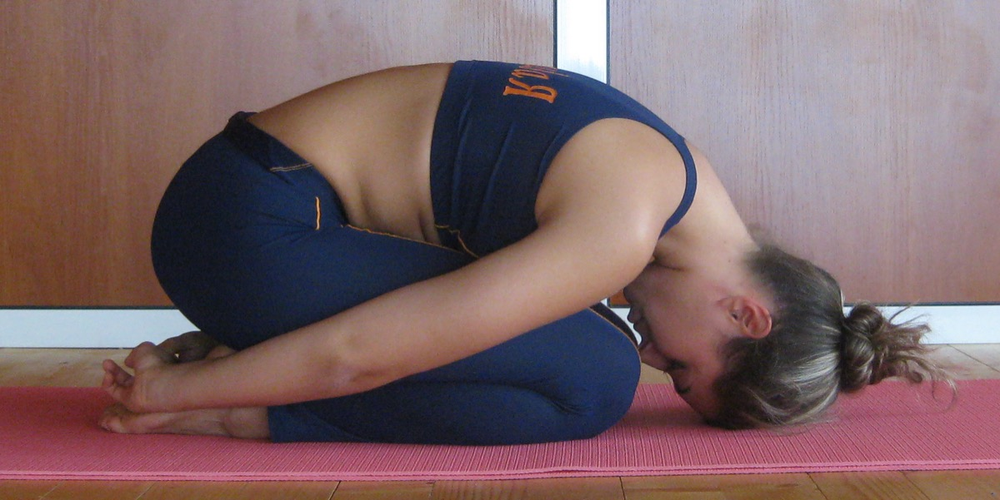

# Balasana

[TOC]

The name **Balasana** is derived from sanskrit words bala means child and asana means posture. It provides physical, mental and emotional relief. It is useful in relieving back, shoulder, neck and hip strain.
## Technique
1. Kneel down on the floor and touch your big toes to each other as you sit on your heels. Once you are comfortable, spread your knees hip-width apart. Inhale.
1. Bend forward, and lay your torso between your thighs as you exhale, now, broaden the sacrum all across the back of the pelvis, and narrow the points of your hip such that they point towards the navel. Settle down on the inner thighs.
1. Stretch the tailbone away from the back of the pelvis as you lift the base of your head slightly away from the back of the neck.
1. Stretch your arms forward and place them in front of you, such that they are in line with your knees. Release the fronts of your shoulder to the floor.
1. You must feel the weight of the front shoulders pulling the blades widely across your back.
1. Since this asana is a resting pose, you can stay in the pose from anywhere between 30 seconds to a few minutes.
1. To release the asana, first stretch the front torso. Then, breathe in and lift from the tailbone while it pushes down into the pelvis.

## Effects
* Releases tension in the back, shoulders and chest
* Recommended if you have dizziness or fatigue
* Helps alleviate stress and anxiety
* Flexes the body’s internal organs and keeps them supple
* It lengthens and stretches the spine
* Relieves neck and lower back pain when performed with the head and torso supported
* It gently stretches the hips, thighs and ankles
* Normalizes circulation throughout the body
* It stretches muscles, tendons and ligaments in the knee
* Calms the mind and body
* Encourages strong and steady breathing

## Related Asanas
* [Virasana](../yoga/Virasana.md)

## Special requisites
* If you find it difficult or uncomfortable to place your head on the floor, you can use a pillow for comfort.
* It is best to avoid doing this asana if you are suffering from diarrhea or knee injuries.
* Patients with high blood pressure must avoid practicing this asana.

## Initial practice notes
We usually don't breathe consciously and fully into the back of the torso. Balasana provides us with an excellent opportunity to do just that. Imagine that each inhalation is "doming" the back torso toward the ceiling, lengthening and widening the spine. Then with each exhalation release the torso a little more deeply into the fold.

## References

## External Links
* [Balasana on easyayurveda.com/](https://easyayurveda.com/2018/01/29/balasana-childs-pose-childs-resting-pose-fetal-pose/)
* [Balasana on rishikulyogshala.org](https://www.rishikulyogshala.org/top-10-health-benefits-of-balasana-child-pose/)
* [Balasana on 7pranayama.com](http://7pranayama.com/balasana-child-pose-yoga-steps-benefits-precaution/)

## References

1. ["Methodology"](http://www.stylecraze.com/articles/balasana-child-pose/#HowToDoTheBalasana)
2. [tips"]("Beginers)(https://www.yogajournal.com/poses/child-s-pose)
3. ["Benefits"](http://www.cnyhealingarts.com/2010/11/08/the-health-benefits-of-balasana-childs-pose/)
