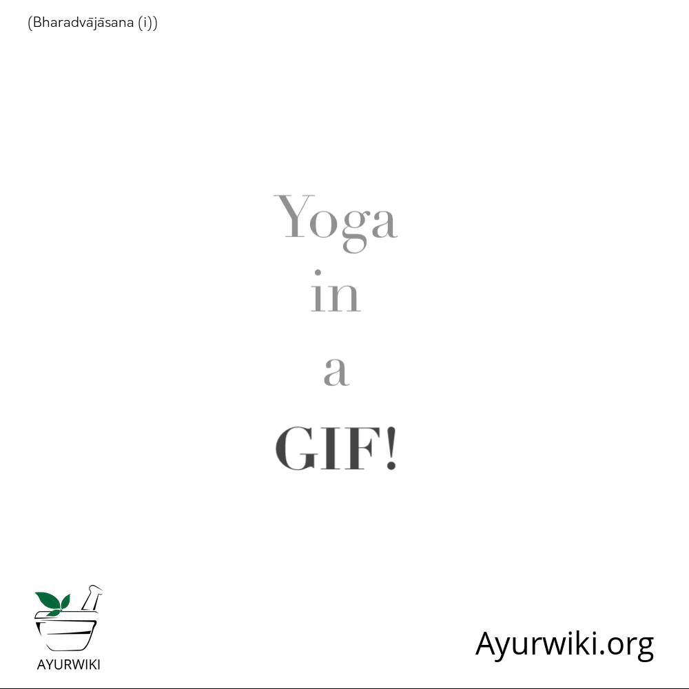
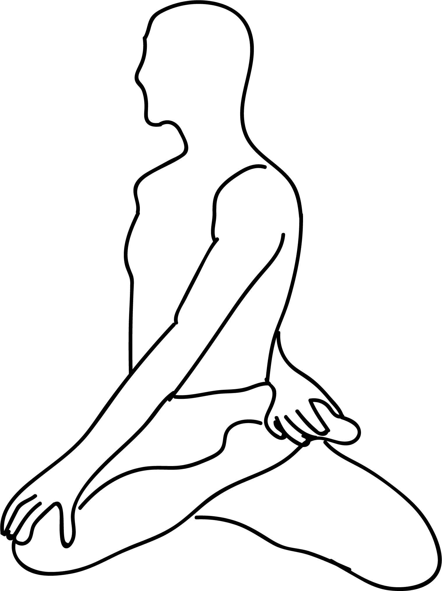

# Bharadvajasana

[TOC]

The name of **Bharadvajasana** or **Bharadvaja’s Twist** is inspired from the Sage (Rishi) “Bharadvaja”; who was one of the seven Saptarshis and he was the father of Guru Drona. Rishi Bharadvaja also created the hymns from the Vedas. Bharadvajasana is also known as “seated twist pose” or “Bharadvaj twist”.

## Technique
1. Sit on the floor, with your back erect and your legs stretched out in front of you. Place your arms beside your body, close to your hips.
1. Bend your knees and bring them close to your left hip, such that the right buttocks carry the weight of the body. Rest the inner side of your left ankle on the arch of your right thigh.
1. Inhale and stretch your spine, extending it as much as you possibly can. Exhale and twist the upper trunk as much as you can. Place your right hand on the floor, and your left hand on the right outer thigh.
1. Make sure that your hip on the left side presses your body weight down on the floor.
1. Slightly bend the upper part of the back and twist around your backbone, such that you feel the effect from the lower back to the tip of the head.
1. Keep lengthening your spine as you intensify your twist every time you exhale.
1. Turn your head such that you look over your right shoulder. Hold the pose for about a minute.
1. Exhale and gently untwist your trunk to come back to the center. Take a breath, and repeat the pose with the weight of your body on the left buttock

## Effects
* Practicing Bharadvajasana consistently helps in extending and fortifying your arms, shoulders, spine, thighs, waist, calf muscles and your lower legs (Ankles).
* It relives in lower back agony, neck torment and sciatica torment.
* It is good remedial for Carpal Tunnel Syndrome.
* It is beneficial in the symptoms of stress.
* It gently massages the organs of abdominal.
* It boosts the digestive system.
* It enhances lungs capacity.
* It stretches belly and reduces the fat of your belly.
* Daily practices help in reducing side fats of your body.
* It improves the blood circulation in body.

## Related Asanas
* [Baddha Konasana](Baddha_Konasana.md)
* [Supta Padangusthasana](../yoga/Supta_Padangusthasana.md)
* [Utthita Trikonasana](../yoga/Utthita_Trikonasana.md)
* [Virabhadrasana II](../yoga/Virabhadrasana_II.md)
* [Virasana](../yoga/Virasana.md)
* [Vrksasana](Vrksasana.md)
* [Uttanasana](../yoga/Uttanasana.md)
* [Paschimottanasana](../yoga/Paschimottanasana.md)
* [Janu Sirsasana](../yoga/Janu_Sirsasana.md)

## Special requisites
Avoid this asana if you have the following conditions:

* Diarrhea
* Headache
* High blood pressure
* Insomnia
* Low blood pressure
* Menstruation

## Initial practice notes
If you tilt onto the twisting-side buttock (which compresses the lower back), raise it up on a thickly folded blanket. Consciously sink both sitting bones toward the floor

## References

## External Links
* [Bharadvajasana on stylesatlife.com](http://stylesatlife.com/articles/bharadvajasana/)
* [Bharadvajasana on yogaoutlet.com](https://www.yogaoutlet.com/guides/how-to-do-bharadvaja_s-twist-in-yoga)
* [Bharadvajasana on lifenlesson.com](https://lifenlesson.com/how-to-do-the-bharadvajasana-and-what-are-its-benefits/)

## References

1. ["Methodology"](http://www.stylecraze.com/articles/seated-twist-asana-how-to-do-and-what-are-its-benefits/#HowToDoTheBharadvajasana)
2. [tips"]("Beginers)(https://www.yogajournal.com/poses/bharadvaja-s-twist)
3. ["Benefits"](https://www.sarvyoga.com/bharadvajasana-bharadvajas-twist-or-seated-twist-asana-steps-and-benefits/)
