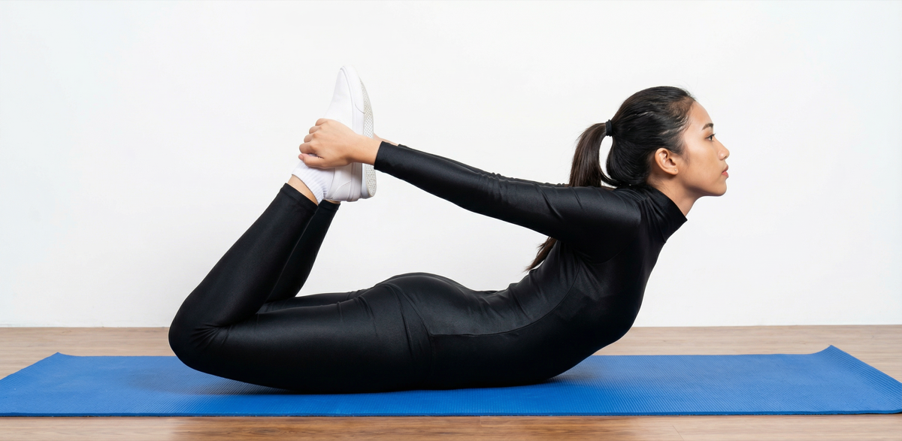

# Bhekasana

[TOC]

The **Frog Pose** or **Bhekasana** is a pose is one of the most difficult and challenging yoga poses. This pose has many variations and this is why it is also known as Mandukasana.

## Technique
1. Start by lying down on your front,
1. Inhale, come up onto the forearms so that you can lift your head and upper torso.
1. Exhale, bend your right knee and bring the heel toward the right hip. Using the left forearm for support, reach back with your right hand and clasp the inside of your foot. Using the bind for suppots bring the left leg into the same position.
1. Inhale, rotate your elbows toward the sky, so that your hands are over the top of the feet. (Your palms should be on the tops of the feet) Using the hands press the heels down towards the floor.
1. Square your shoulders with the front of the making sure they are down and away from the ears. Keep the chest lifted.
1. Keep the breaths long and strong,
1. Exhale, release the posture, come into relaxation.

## Effects
* This posture is beneficial for the back as it strengthens the muscles of the back. It also helps improve posture.
* It extends the hips and the quadriceps.
* It is a very good posture to rejuvenate the knee joints as the psoas muscles and the quadriceps are stretched in this pose.
* It improves digestion by stimulating the abdominal organs.
* This posture extends the entire front and back of the body and strengthens joints and muscles throughout the body.
* It extends the throat, chest and abdomen, groin, thighs and ankles

## Related Asanas
* [Adho Mukha Svanasana](../yoga/Adho_Mukha_Svanasana.md)
* [Garudasana](../yoga/Garudasana.md)

## Special requisites
Dont do this pose while you are suffering from below health issues:

* Rotator cuff injuries
* High or low blood pressure
* Migraine
* Insomnia
* Low back, neck or shoulder injuries

## Initial practice notes
Support the lift of the upper torso with a bolster under your lower ribs, and press your free forearm on the floor in front of the bolster.

## References

## External Links
* [Bhekasana on ](http://stylesatlife.com/articles/bhekasana/)
* [Bhekasana on ](http://www.yogawiz.com/Yoga-Poses/yoga-asanas/half-frog-pose-ardha-bhekasana.html)
* [Bhekasana on ](https://www.yogapedia.com/definition/6439/bhekasana)

## References

1. ["Methodology"](http://pranayoga.co.in/asana/bhekasana-frog-posture/)
2. [tips"]("Beginers)(https://www.yogajournal.com/poses/half-frog-pose)
3. ["Benefits"](http://vinyasayogaacademy.com/blog/benefits-of-yoga-ardha-bhekasana-half-frog-pose/)
