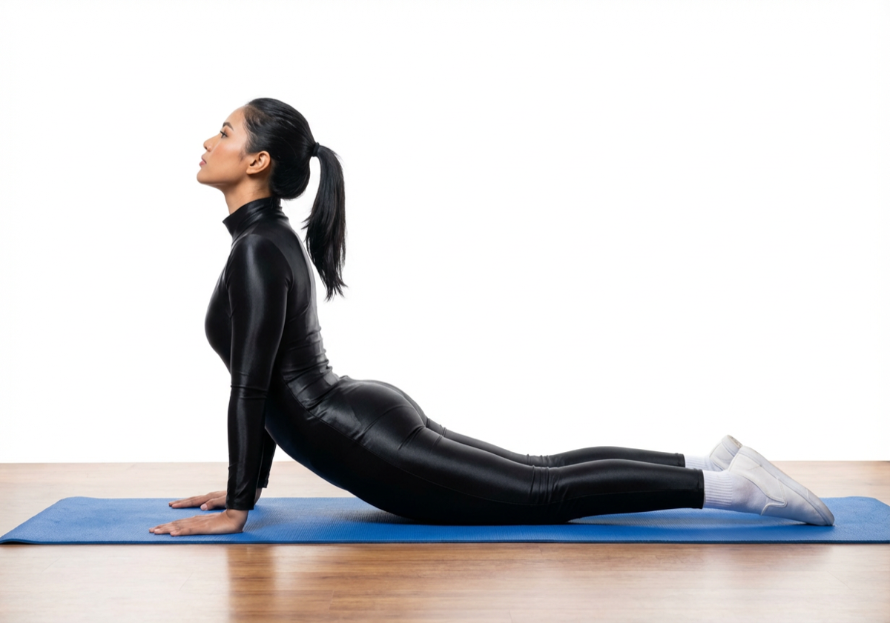

# Bhujangasana

[TOC]

In Sanskrit **bhujanga** means snake and **asana** means pose; that’s why this yoga pose is referred to as  the **Cobra Pose**. This pose mimics the posture of a cobra that has its hood raised. It is the eighth pose in the 12 poses of the Surya Namaskar or Sun Salutation yoga routine.

## Technique
1. Start by lying on your stomach and rest your forehead on the floor.

1. Keep your feet together and your toes touching the ground. Place your hands at shoulder level and palms on floor

1. As you inhale lift your head, chest and abdomen and make sure that you keep the navel on the floor.

1. Hold this posture for 5 breaths

1. As you exhale, slowly come down rest with your hands below your head.

## Effects
* Stretches muscles in the shoulders, chest and abdominals and decreases stiffness of the lower back.
* Strengthens the arms and shoulders and increases flexibility.
* Improves menstrual irregularities, elevates mood and firms and tones the buttocks.
* Invigorates the heart and stimulates organs in the abdomen, like the kidneys.
* Relieves stress and fatigue and opens the chest and helps to clear the passages of the heart and lungs.
* Improves circulation of blood and oxygen, especially throughout the spinal and pelvic regions.
* Improves digestion, strengthens the spine, soothes sciatica.
* Helps to ease symptoms of asthma

## Related Asanas
* [Urdhva Mukha Svanasana](../yoga/Urdhva_Mukha_Svanasana.md)
* [Setu Bandhasana](../yoga/Setu_Bandhasana.md)
* [Sarvangasana](../yoga/Sarvangasana.md)

## Special requisites
This exercise should be avoided if you suffer from the following problems:

* Hernia
* Back injuries
* Carpal tunnel syndrome
* Headaches
* Pregnancy
* Recent abdominal surgeries

## Initial practice notes
As a beginner, you must not go all into the asana. If you do so, you will end up straining your back and neck. You must find a height that suits you, and ensure you don’t strain your back and neck. Once you do, take your hands off the floor for a moment so that you have a thorough extension.

## References

## External Links
* [Bhujangasana on gyanunlimited.com](http://www.gyanunlimited.com/health/top-10-best-health-benefits-of-bhujangasana-cobra-pose-yoga/11366/)
* [Bhujangasana on cnyhealingarts.com](http://www.cnyhealingarts.com/2010/12/24/the-health-benefits-of-bhujangasana-cobra-pose/)
* [Bhujangasana on easyayurveda.com](https://easyayurveda.com/2018/01/16/bhujangasana-cobra-pose/)

## References

1. ["Methodology"](https://www.sepalika.com/type-2-diabetes/cobra-pose-benefits/)
2. [tips"]("Beginers)(http://www.stylecraze.com/articles/bhujangasana-cobra-pose/#Beginner’sTip)
3. ["Effects"](https://www.rishiyogpeeth.com/)
