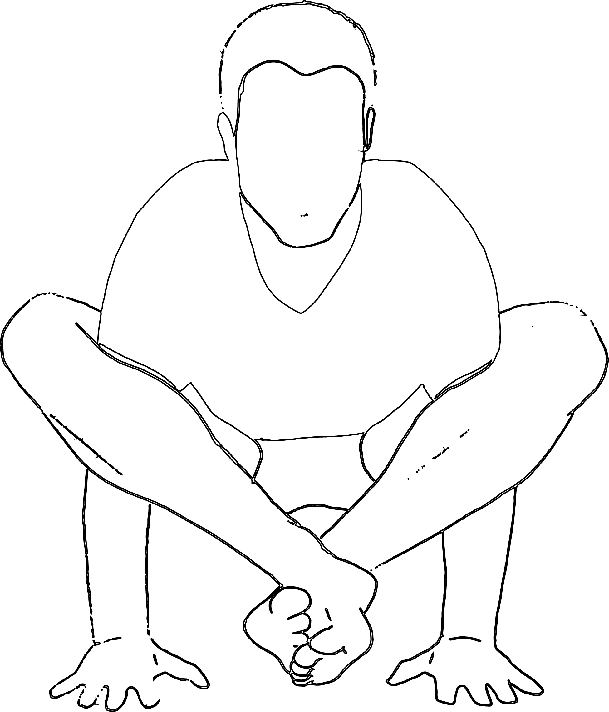

# Bhujapidasana

[TOC]

The **Bhujapidasana** is one of the most important poses of Yoga and is also known as the Shoulder pressing posture. The name comes from the Sanskrit word **Bhuja** meaning arm or shoulder and **Pida** meaning **pressure** and **asana** meaning posture. This pose is basically simple to do but at times can cause some about of pain for person who tries it, mostly in the beginning.

## Technique
1. Move your hands forward and feet backwards as well as lift the hip up.
1. Now fold your knees and bring both of your legs in front of your hands.
1. Bring your hands from under your knees and touch the floor with palm
1. After this, put your entire body weight on the hands and make the cross by both legs.
1. Now slowly move your legs backwards and keep your head on the ground.
1. Stay in this position for a few seconds, then relax. Repeat this again.

## Effects
* This asana helps improve a sense of balance and concentration.
* It makes the wrists, shoulders, arms, and upper body strong.
* The abdomen gets a good stretch, and therefore, digestion is improved.
* This asana nourishes the thyroid gland. Therefore, the heart rate is controlled, the nervous system is balanced, and metabolism is regulated.
* The blood circulation is improved.
* This asana helps relieve stress and headache.

## Related Asanas
* [Bakasana](../yoga/Bakasana.md)
* [Baddha Koṇāsana](Baddha_Koṇāsana.md)
* [Mālāsana](Mālāsana.md)
* [Garudasana](../yoga/Garudasana.md)

## Special requisites
* If you have any kind of injury on the wrist, elbows, lower back and shoulder, then do not do this asana.
* If you have problems with cervical spondylosis and blood pressure then avoid this posture.
* Take help of yoga instructor for doing this posture. (Also read: What are the benefits of doing yoga barefoot)

## Initial practice notes
Beginners may find this pose a little bit challenging as it requires a lot of strength and balance. Those who find it difficult to perform this pose can start by using a bloster or a yoga block to support their buttocks while attempting this pose initially. It is always best to have a yoga instructor if you are a beginner.

## References

## External Links
* [Bhujapidasana on harmonyyoga.com](http://harmonyyoga.com/benefits-of-bhujapidasana-firefly-pose)
* [Bhujapidasana on www.yogajournal.com](https://www.yogajournal.com/poses/shoulder-pressing-pose)
* [Bhujapidasana on stylesatlife.com](http://stylesatlife.com/articles/bhujapidasana/)

## References

1. ["Methodology"](https://www.lifealth.com/lifestyle/yoga/how-to-do-bhujapidasana-and-what-are-its-benefits-av/69894/)
2. [tips"]("Beginers)(http://www.astrolika.com/yoga/bhujapidasana.html)
3. ["Benefits"](http://www.stylecraze.com/articles/bhujapidasana-shoulder-pressing-pose/#TheBenefitsOfTheShoulder-PressingPose)
