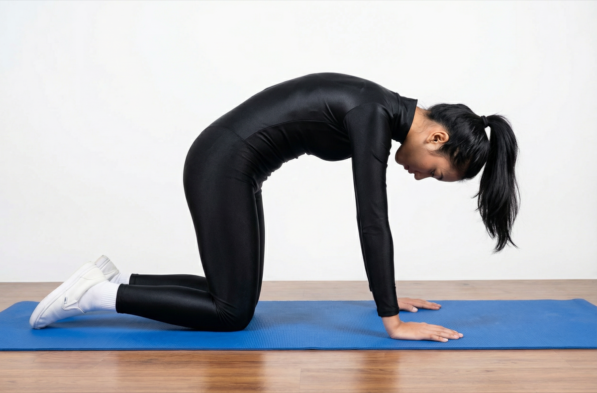

# Bidalasana

[TOC]

**Bidalasana** is also known as the Cat Stretch pose. It is a simple, yet thorough way to warm up. It stretches back and abdominal muscles and helps to initiate movement from your center and to coordinate your movement and breath.

## Technique
1. Start on your hands and knees in a “tabletop” position.
1. Make sure that your knees are positioned directly below your hips. Your wrists, elbows and shoulders should be in line and perpendicular to the floor.
1. Center your head in a neutral position, with your eyes looking at the floor.
1. As you exhale, smoothly arch your spine upwards towards the ceiling, making sure to keep your shoulders and knees in position.
1. Release your head toward the floor, but don’t force your chin to your chest, inhale and come back to the neutral “tabletop” position on your hands and knees.
1. In order to perform this pose effectively you must take certain precautions. Always try to keep your shoulders down and neck elongated. In case of any neck injury or pain, you are supposed to make use of your neck with care. Do not involve it much in the motion. You must also avoid using this pose in case of back injury or pain.

## Effects
* Improves posture and balance
* Strengthens and stretches the spine and neck
* Stretches the hips, abdomen and back
* Increases coordination
* Massages and stimulates organs in the belly, like the kidneys and adrenal glands
* Creates emotional balance
* Relieves stress and calms the mind

## Related Asanas
* [Balasana](../yoga/Balasana.md)
* [Garudasana](../yoga/Garudasana.md)

## Special requisites
* In order to perform this pose effectively you must take certain precautions. Always try to keep your shoulders down and neck elongated. In case of any neck injury or pain, you are supposed to make use of your neck with care. Do not involve it much in the motion. You must also avoid using this pose in case of back injury or pain.

## Initial practice notes
If you have difficulty rounding the very top of the upper back, ask a friend to lay a hand just above and between the shoulder blades to help you activate this area.

## References

## External Links
* [Bidalasana on stylesatlife.com](http://stylesatlife.com/articles/bidalasana/)
* [Bidalasana on indovacation.net](http://www.indovacation.net/India-Shopping/Yoga/bidalasana.htm)
* [Bidalasana on tummee.com](https://www.tummee.com/yoga-poses/bidalasana/benefits)

## References

1. ["Methodology"](https://thehealthorange.com/stay-fit/yoga/how-to-do-marjaryasana-cat-pose-in-5-steps-its-benefits/)
2. [tips"]("Beginers)(https://www.yogajournal.com/poses/cat-pose)
3. ["Benefits"](http://www.cnyhealingarts.com/2011/04/02/the-health-benefits-of-cat-cow-stretch/)
