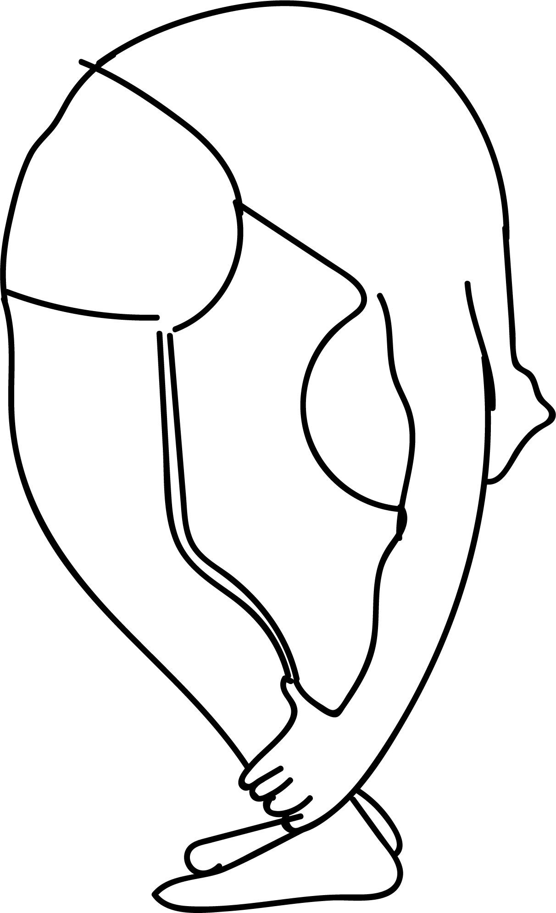

# Chakra Bandhasana

[TOC]

**Chakra Bandhasana** is an Asana. It is translated as Bound Wheel Pose from Sanskrit. The name of this pose comes from "chakra" meaning "wheel", "bandha" meaning "bound", and "asana" meaning "posture" or "seat".

## Technique
1. Lie flat on your back. Keep your feet together and hands by the side of your hips, head resting on the floor.
1. Bend your knees and bring your heels closer to your sitting bones. Place your heels flat on the floor. Keep some distance between your heels.
1. Bend your elbows and press your palms on the floor. Make sure your palms are comfortably placed next to your head and your fingers are pointing toward your shoulders. The distance between your palms should be the same as the distance between your feet.
1. Press your feet and palms against the floor. Exhale and gradually lift your hips off the floor. Let your arms and legs support your body weight equally.
1. Push with your arms and legs to bring the crown of your head upon the floor.
1. Walk your palms towards your heels and grab your ankles.
1. Press your feet firmly against the floor and lift your head off the floor.
1. Lengthen your spine and try to turn your head to face the ground.
1. Stay in this pose for 15 seconds or as long as you can. (Keep breathing to avoid muscle cramps)

## Technique in pictures/animation
## Effects
* Relieves stress, anxiety, depression and fatigue.
* Energizes the body, stimulates the thyroid and pituitary glands.
* Slows down aging, stretches the chest and lungs region.
* Increases flexibility, calms the nervous system.
* Creates hormonal balance, strengthens the arms, wrists, legs, hips, abdomen, spine and shoulders.
* Improves digestion, recommended for people with infertility, asthma, back pain and osteoporosis.

## Related Asanas
* [Bhujangasana](../yoga/Bhujangasana.md)
* [Setu Bandha Sarvangasana](../yoga/Setu_Bandha_Sarvangasana.md)
* [Urdhva Mukha Svanasana](../yoga/Urdhva_Mukha_Svanasana.md)
* [Virasana](../yoga/Virasana.md)

## Special requisites
* Anyone suffering from severe back, neck or head injuries, carpal tunnel syndrome, heart problems, high or low blood pressure, diarrhea.

## Initial practice notes
Beginners can use props.  Beginners may use a wedge/bolster to your back for maintaining body balance during performing this Asana, dont do this asana dierctly take support from trainers and do it.

## References

## External Links
* [Chakra Bandhasana on gurmeet.net](http://gurmeet.net/yoga/pose_chakra_bandhasana/)
* [Chakra Bandhasana on jackcuneo.com](http://www.jackcuneo.com/blog/2015/5/19/chakra-bandhasana-bound-wheel-pose)
* [Chakra Bandhasana on grimmly2007.blogspot.com](http://grimmly2007.blogspot.com/2013/11/towards-chakra-bandhasana-in-month.html)

## References

1. ["Methodology"](https://365dayspact.wordpress.com/2017/08/11/chakra-bandhasana-bound-wheel-pose-the-wheel-of-life/)
2. ["Benefits"](https://365dayspact.wordpress.com/2017/08/11/chakra-bandhasana-bound-wheel-pose-the-wheel-of-life/)
