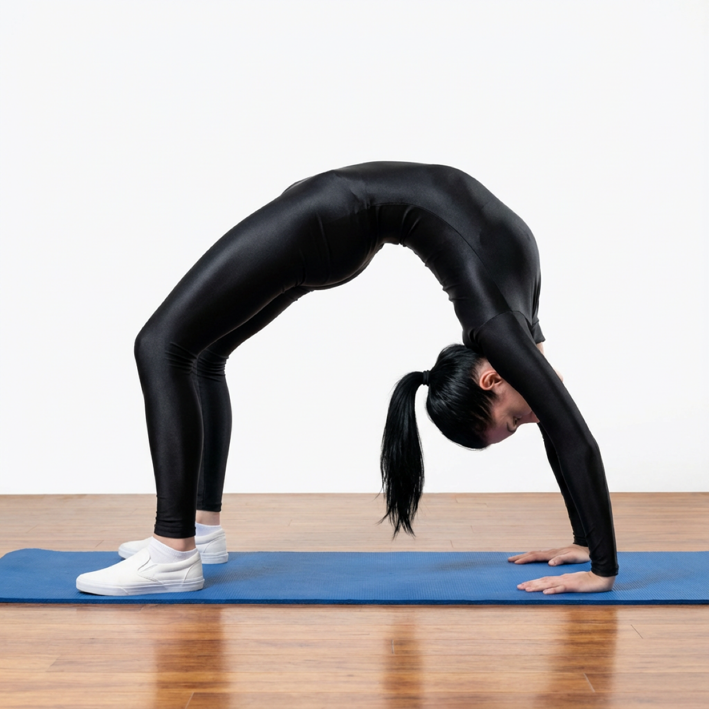

# Chakrasana

[TOC]

The name **Chakrasana** comes from the Sanskrit words **Chakra** which means wheel, and meaning of Asana is **Posture** or **seat**. Chakrasana or the wheel pose is a backward bending yoga asana. Chakra in Sanskrit means Wheel. In chakrasana, the final position looks like a wheel, hence the name. It gives great flexibility to the spine. It is called chakrasana since the body takes almost a wheel-like, semi circular posture while performing this asana.

## Technique
1. Lie down on your back with feet apart ,bend your knees and place your feet on the ground close to your body.
1. Now bring your palms under your shoulders such that the fingers point towards the shoulders and the elbows are shoulder width apart.
1. Inhale and press your palms firmly into the floor.
1. Lift your shoulders and elbow firmly into the floor
1. Your Feet should be pressed firmly into the floor.
1. Inhale and lift your hips up.
1. The spine should be rolled up so that it may seem to resemble a semi circular arch or wheel.
1. Straighten out your arms and legs as much as possible so that the hips and chest maybe pushed up.
1. Hold this pose for at least 15-30 seconds.
1. To go back to original, bend your elbows to lower your head and shoulders to the floor.
1. Then bend your knees and bring your spine and hips back to the ground and relax.

## Technique in pictures/animation
## Effects
* Strengthens liver, pancreas and kidneys.
* Excellent for heart.
* Good for infertility, asthma and osteoporosis.
* Strengthens arms, shoulders, hands, wrists and legs.
* Stretches the chest and lungs
* Strengthens the arms and wrists, legs, buttocks, abdomen, and spine
* Stimulates the thyroid and pituitary glands.
* Increases energy and counteracts depression.

## Related Asanas
* [Bhujangasana](../yoga/Bhujangasana.md)
* [Setu Bandha Sarvangasana](../yoga/Setu_Bandha_Sarvangasana.md)
* [Urdhva Mukha Svanasana](../yoga/Urdhva_Mukha_Svanasana.md)
* [Virasana](../yoga/Virasana.md)

## Special requisites
These are some points of caution you must keep in mind before doing this asana:

* It is best to avoid this asana if you have tendonitis in the wrists or carpal tunnel syndrome.
* If your lower back starts to hurt due to the extension, immediately come out of the pose.
* You must steer clear of this asana if you have a shoulder impingement.
* Do not do this asana if you suffer from headaches or high blood pressure.

## Initial practice notes
As a beginner, when you do this pose, you will find your feet and knees splaying as you lift your body to assume this pose. This will tend to compress your lower back. So, you can use a strap on your thighs to keep them hip-width apart throughout the asana.

## References

## External Links
* [Chakrasana on finessyoga.com](http://www.finessyoga.com/yoga-asanas/chakrasana-wheel-pose-steps-benefits)
* [Chakrasana on linkedin.com](https://www.linkedin.com/pulse/chakrasana-wheel-pose-steps-benefits-rishikeshyogsansthan-rys)
* [Chakrasana on naturehomeopathy.com](https://www.naturehomeopathy.com/procedure-and-benefits-of-chakrasana-wheel-pose.html)

## References

1. ["Methodology"](https://arogyayogaschool.com/blog/health-benefits-of-chakrasana-urdva-dhanurasana-with-steps-wheel-pose/)
2. [tips"]("Beginers)(http://www.stylecraze.com/articles/urdhva-dhanurasana-upward-bow-pose-wheel-pose/#Beginner’sTips)
3. ["Benefits"](http://simpleyogaathome.com/anantasana-vishnus-couch-pose/)
