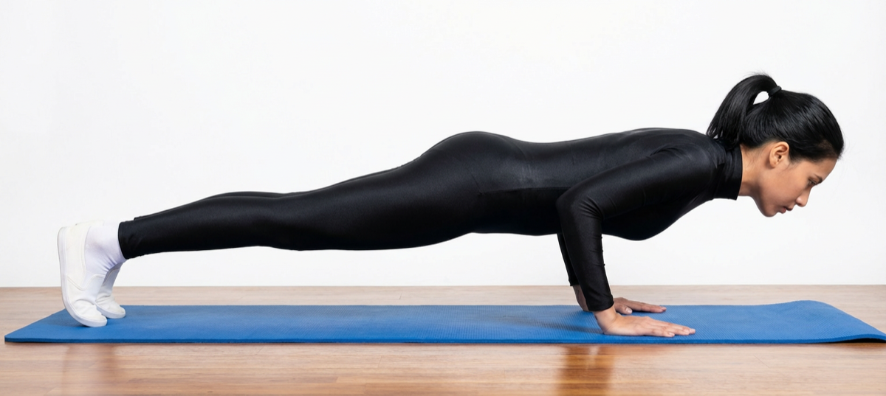

# Chaturanga Dandasana

[TOC]

**Chaturanga Dandasana** is a major component of Ashtanga, Vinyasa, Hatha and Power Yoga. The english translation of this Snaskrit word is **Four-limbed-staff-pose**. A plank is challenging enough, but this low plank really tests the arm and core strength.

## Technique
1. First take a position of Downward facing dog pose (Adho Mukha Svanasana) after that come into plank pose (Note that your shoulder bones are pushed immovably against your back and that your tailbone is pushed towards the pubis.)
1. Keep your arms fully extended and keep your spine completely erect.
1. Breathe out, bend your elbows and keep down your lower body towards the ground but not touching it, stop at a point when you are few inches away from the floor or ground.Chaturanga-Dandasana-steps.
1. Keep your body parallel to the ground and your hips ought to be straight. Turn your legs inward during this position.
1. Keep wide space between your shoulder blades.
1. Your elbows ought not be spread outwards but rather be pushed back downwards towards the heel.
1. Assure that your neck is adjusted straight with the rest of body and press the base of your forefingers to the ground.
1. Remain in this position for around 10-30 seconds and after that breathe out and rests gently on the floor.
1. Repeat this process for 3 to 6 times.

## Technique in pictures/animation
## Effects
* Strengthens arm, shoulder, and leg muscles.
* Develops core stability.
* Prepares body for inversions and arm balances.
* Increases stamina.
* Invigorates the mind and body.

## Related Asanas
* [Plank Pose](Plank_Pose.md)
* [Bhujangasana](../yoga/Bhujangasana.md)
* [Urdhva Mukha Svanasana](../yoga/Urdhva_Mukha_Svanasana.md)

## Special requisites
Avoid practicing this asana if you have the following conditions:

* Carpal tunnel syndrome
* Pregnancy
* Lower back Injury
* Wrist injury
* Shoulder Injury

## Initial practice notes
As a beginner, it might be hard to do the Chaturanga Dandasana because you need first to make your legs, arms, and back strong enough to support you. So, until you gain that strength from practicing this asana, do this. Once you assume the Plank Pose, lower your knees to the floor. Then, exhale and lower your sternum, such that it is an inch or two above the ground.

## References

## External Links
* [Chaturanga Dandasana on yogajournal.com](https://www.yogajournal.com/poses/four-limbed-staff-pose)
* [Chaturanga Dandasana on stylesatlife.com](http://stylesatlife.com/articles/chaturanga-dandasana/)
* [Chaturanga Dandasana on doyouyoga.com](https://www.doyouyoga.com/yoga-pose-101-chaturanga-dandasana/)

## References

1. ["Methodology"](https://www.sarvyoga.com/chaturanga-dandasana-four-limbed-staff-pose-steps-and-benefits/)
2. [tips"]("Beginers)(http://www.stylecraze.com/articles/chaturanga-dandasana-four-limbed-staff-pose/#Beginner’sTip)
3. ["Benefits"](http://harmonyyoga.com/benefits-of-chaturanga-dandasana)
